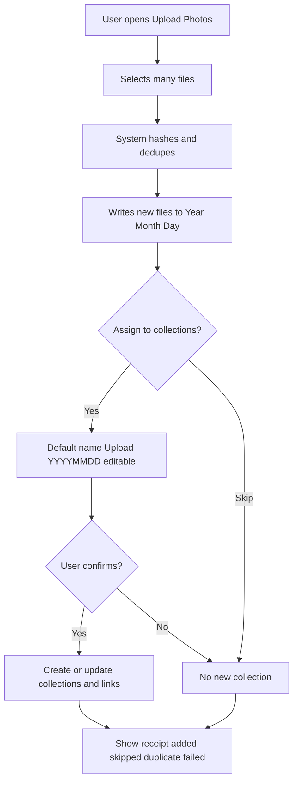
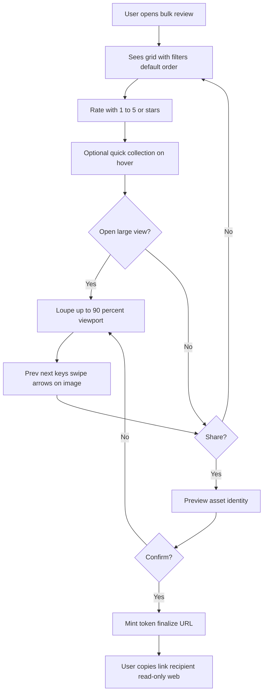
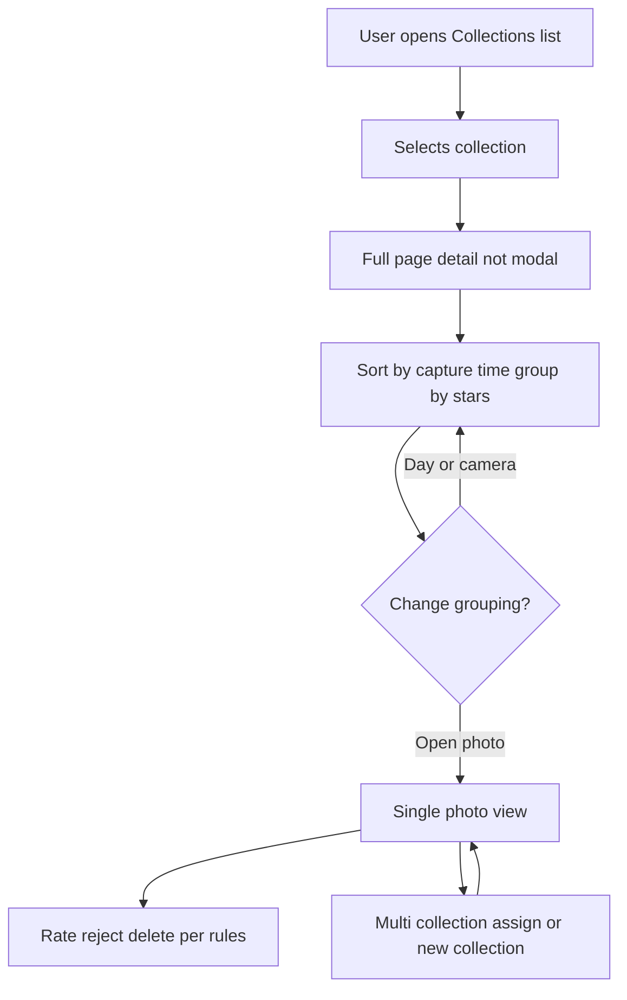
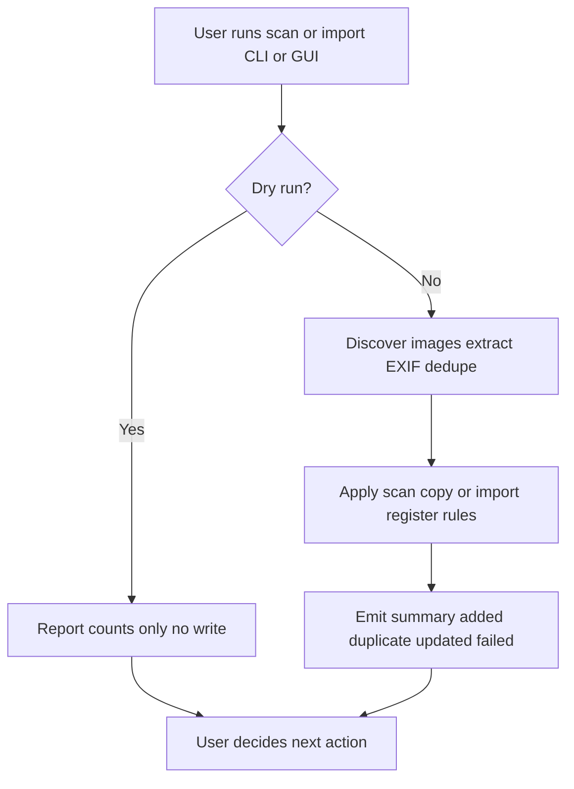
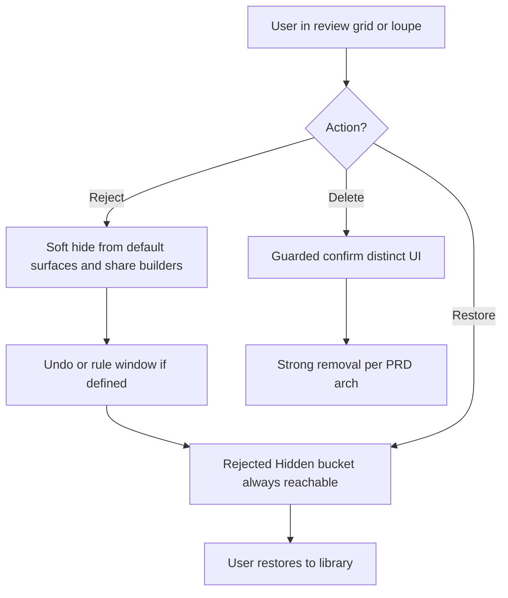
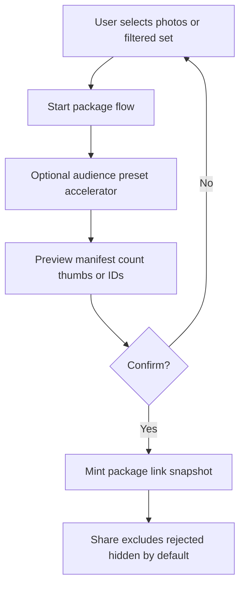

---
stepsCompleted:
  - 1
  - 2
  - 3
  - 4
  - 5
  - 6
  - 7
  - 8
  - 9
  - 10
  - 11
  - 12
  - 13
  - 14
lastStep: 14
workflowCompleted: '2026-04-12'
inputDocuments:
  - _bmad-output/planning-artifacts/PRD.md
  - docs/input/initial-idea.md
---

# UX Design Specification photo-tool

**Author:** Sergej Brazdeikis
**Date:** 2026-04-12

---

<!-- UX design content will be appended sequentially through collaborative workflow steps -->

## Executive Summary

### Project Vision

Photo Tool helps people import, deduplicate, and organize large personal photo libraries using capture-time-aware storage, then review and curate with ratings, tags, and collections—primarily through a fast desktop experience (Fyne), with the web used for shared review. Users should be able to **filter by rating** and use **Reject** to **soft-hide** poor or unwanted images so they **do not appear again** in normal browsing, filtering, or sharing, with recovery from a dedicated rejected/hidden place. **Delete** is a **separate, stronger action** (exact persistence—library-only, trash, or file removal—is a PRD/architecture decision). The product should make it **extremely simple** to assemble **sharable packages**: curated subsets (e.g. a rated and sorted trip) with **audience-appropriate** sharing—not one global share-all (e.g. small friend group vs wider friends vs parents). Success hinges on layout resilience from square through ultrawide viewports, honest import feedback, a clear split between “edit in app” and “view in browser,” trustworthy sharing, and **non-destructive-but-invisible** reject flows that are hard to trigger by mistake.

### Target Users

Hobbyist and semi-pro photographers and organizers who manage large local libraries, need efficient bulk operations and predictable on-disk structure, want to **clear noise quickly** without irreversible loss by default, and want to **share different slices** with different people without manual re-foldering.

### Key Design Challenges

- Keeping primary navigation and controls fully visible in bulk and single-photo review from **1:1** through **21:9**, with the image fitting within ~**90%** of the viewport without cropping.
- Bulk review density: hover actions, filters, and collection assignment at scale without errors or hidden affordances.
- Desktop vs web: full metadata and editing on desktop; shared views read-only where specified; **no raw GPS** on shared pages per PRD; WCAG **2.1 Level A** for the share-link page.
- **Sharable packages** and **audience tiers**: minimal steps to create, rare mis-sharing, clear mental models.
- **Reject** vs **Delete**: distinct controls and expectations; rejected assets excluded from default surfaces and package builders; delete semantics defined in PRD (MVP vs Growth).

### Design Opportunities

- Keyboard-driven rating, navigation, and **fast Reject** paired with undo or clear restore paths.
- Collection-centric browsing and rating thresholds for **quality passes** and **trip curation** before sharing.
- **Package presets** (audience templates); **exclude rejected/hidden** by default with obvious rules.
- Trust: duplicate summaries, confirm-before-collection on upload, unified upload/scan/import behavior.

## Core User Experience

### Defining Experience

The core loop is **ingest → triage → organize → share selectively**. Users bring photos in (upload or scan/import), **deduplication and capture-time layout** stay honest and visible, then they spend most time in **bulk review** and **collection browsing**: rating (1–5), tagging, **Reject** (soft-hide from all default surfaces and from share/package builders), optional **Delete** (stronger removal—exact behavior TBD in PRD), and collection assignment.

**Sharing:** Any flow that exposes photos outside the app—**single-photo links** (current PRD MVP) or, when in scope, **sharable packages**—must include a **clear preview of what will be shared** before a link is created. For a **single photo**, preview can be minimal (identity confirmation); for **multi-asset packages**, preview must surface an explicit **list or thumbnail set** matching the selection. **Default share semantics: snapshot**—the link resolves to a **fixed set of assets (and renditions) as of creation time**—unless the PRD explicitly defines **live** collection links and recipient copy states that **content may change**.

**Audience presets** (e.g. close friends vs wider circle vs parents) are **accelerators** on a **simple default path**, not a mandatory wall of choices on first use.

**Scope honesty:** The PRD today emphasizes **single shareable URLs** and **read-only** web review for MVP. **Multi-photo packages** and **rich audience modeling** are **stakeholder-critical UX intent**; they require an **explicit PRD/epic decision** (MVP vs Growth) and dated alignment so UX acceptance criteria and engineering scope stay testable.

**Interaction safety:** **Reject** is a **different action family** than **star rating**—including **keyboard layout**: do not place Reject adjacent to **1–5** in a way that causes accidental hides.

### Platform Strategy

- **Primary:** Desktop app (**Go + Fyne**) on **macOS** and **Windows** (tier-1), **Linux** tier-2—**mouse/keyboard-first**, touch where supported.
- **Authority:** The **desktop library** is the **source of truth**; share URLs are **versioned projections** (snapshot payloads) served with **non-guessable tokens** (per PRD/security direction)—not “whatever the DB says now” unless live links are explicitly specified.
- **Secondary:** **Browser** for share recipients; **read-only** editing rules per PRD; **no raw GPS** on shared pages where required; **WCAG 2.1 Level A** for the share-link experience.
- **Offline:** Local triage can be **offline-first**; delivering shares requires network for recipients.
- **CLI parity:** Scan/import tooling must surface the same **reject/delete semantics and summaries** as the GUI so the library’s meaning does not diverge by entry path. *Example expectation:* if the GUI reports **N rejected** in a session, a batch **scan** with equivalent operations must emit a summary line or count that includes **`rejected: N`** (exact format TBD in architecture).
- **Build risk:** **Bulk review + ultrawide layout + keyboard routing** in Fyne should be **prototyped early**—high coupling between density, hover affordances, and window aspect ratios.

### Effortless Interactions

- **Rating and navigation** without extra dialogs: **1–5**, stars, prev/next, arrows aligned to the image.
- **Reject:** fast to apply, with **immediate undo** and/or a **reversible window**—**product/architecture to confirm:** e.g. undo until **navigating away from the current review context**, or a **short time bound** (e.g. 30 seconds), or both in combination. **Recovery** must also remain available from a **Rejected/Hidden** surface.
- **Delete:** visually and procedurally distinct from **Reject** so it is not triggered by mistake.
- **Filters:** fixed order **Collection → minimum rating → tags**, defaults **no assigned collection**, **any rating**.
- **Import feedback:** duplicate counts and **confirm** before creating an upload collection.
- **Packages (when in scope):** short path from selection to link, with **preview-before-publish** always in the chain.

### Critical Success Moments

- **After first large import:** “I see where everything went, duplicates were explained, I did not lose files.”
- **In bulk or single-photo review on ultrawide:** “All controls are visible; the whole image fits; I am not fighting the window.”
- **Before sharing:** “I see **exactly** which photos are in this link or package; the audience matches what I intend.” For **MVP single-photo**, success is still **explicit asset identity** before minting the URL; for **packages**, success requires a **visible multi-asset manifest** in preview.
- **After a mistaken Reject:** “I can undo or restore without panic,” within the **undo rule** agreed in product/architecture.
- **Failure modes that destroy trust:** Wrong or **rejected** assets appear on a share; **Delete** confused with **Reject**; layout hides primary actions; **CLI and GUI** disagree on what’s in the library.

### Experience Principles

1. **Triage first** — Optimize for speed through large sets with keyboard, clear states, and persistence rules aligned to the PRD.
2. **Honest library** — One pipeline truth for upload, scan, and import; operations always explain skips and duplicates.
3. **Reject ≠ delete** — Reject hides and recovers; delete is deliberate and guarded.
4. **Preview before publish** — No share link without a **clear, reviewable** definition of what recipients will see (scaled to single-photo vs package scope).
5. **Layout is a feature** — From square to **21:9**, chrome stays usable and the image stays fully visible in review modes.

**Additional guidance** (supports the above; trace to PRD/epics as needed):

- **Audience-safe sharing** — Packages and links **exclude rejected/hidden** by default; audience choice stays explicit and simple to parse.
- **Composable share model** — Prefer **snapshot** manifests for v1 multi-asset shares; **live** collection links only with explicit PRD copy and technical behavior.
- **Desktop edits, web consumes** — Rich editing and metadata on desktop; web stays within PRD (read-only MVP, GPS rules).
- **Scope honesty** — Call out **MVP vs Growth** wherever PRD still says “single URL” but stakeholders require **packages**.
- **CLI parity** — Scan/import reports and semantics align with the GUI for reject, delete, and registration (see example under Platform Strategy).

### Testability notes (for QA / acceptance)

- **Preview-before-share:** Verifiable expectation: **given** a share action, **then** a confirmation surface lists asset identity (and for packages, **count + IDs or thumbnails**) **before** token minting or URL finalization.
- **Reject undo:** Acceptance tests depend on the chosen **undo rule** (navigation-bound, time-bound, or both); document the chosen rule in PRD or architecture when fixed.

## Desired Emotional Response

### Primary Emotional Goals

Users should feel **in control of a large, messy library**—not overwhelmed by it. The dominant affect is **calm competence**: fast triage without fear of losing files, hiding the wrong things, or sharing the wrong slice. They should also feel **authored control**—**curatorial ownership**: their ratings, rejects, collections, and (when in scope) audience choices express **judgment**, not just filing.

After sustained triage, users should feel a **lighter mental load**—a quiet sense of progress—through **dignified** feedback (e.g. clear session or batch outcomes), not gimmicky celebration.

When sharing, the sharer should never fear **embarrassment** (wrong photo, wrong person, oversharing metadata). **Recipients** should feel **welcome and safe** on share pages: clarity that the view is intentional, read-only where MVP requires, and **no creepy surprises** (e.g. raw GPS withheld per PRD). The product should feel like a **serious organizer’s tool**—keyboard-friendly, honest about the pipeline—rather than a toy gallery.

### Emotional Journey Mapping

- **First use / big import:** **Relief and trust**—clear placement, duplicate honesty, no silent failures. Avoid **dread** (“did it eat my photos?”). *Internal hook:* handing over chaos and getting a **clear receipt** back.
- **Core triage (bulk + single review):** **Flow and focus**—keyboard rhythm, visible chrome on any monitor shape. Avoid **irritation** (hunt for controls), **anxiety** (accidental reject/delete), and **fatigue** from hover-only or tiny targets at volume. *Internal hook:* the pile shrinks; **the controls stay with me**.
- **Organizing (collections, filters):** **Clarity**—mental model matches UI order (collection → rating → tags). Avoid **cognitive load** from arbitrary or shifting filter logic.
- **Sharing (sharer):** **Assurance**—preview-before-publish and audience presets reduce **fear of embarrassment**. MVP: single-photo link still requires **explicit identity confirmation** before minting the URL; Growth/packages: same emotional bar scales to multi-asset preview. *Internal hook:* I chose the **room**; only those people get the **key**.
- **Sharing (recipient):** **Safe and simple**—obvious read-only posture, respectful presentation, privacy expectations met (e.g. location not exposed inappropriately).
- **Adversity (errors, partial failure, disk/EXIF edge cases):** **Proportionate honesty**—clear facts, actionable next steps, **no toxic positivity**. Users can stay **calm** because the system is **straight**, not because it pretends nothing went wrong.
- **After errors or retries:** **Recoverable, not punished**—undo/rejected bucket/CLI parity so the system feels **fair**. Avoid **shame** or **mystery** (“where did it go?”).
- **Return visits:** **Familiar and dependable**—same rules for upload, scan, import. Avoid **mistrust** from inconsistent summaries between **GUI and CLI**.

### Micro-Emotions

Most critical: **trust vs. skepticism** (pipeline and sharing); **confidence vs. confusion** (reject vs delete, what will be shared); **accomplishment vs. frustration** (finishing a trip’s curation); **calm vs. anxiety** (large batches). **Delight** stays **small and professional**—e.g. a satisfying duplicate summary or a stable ultrawide layout—not novelty for its own sake.

### Design Implications

- **Trust** → Plain-language summaries after operations; no hidden states; preview surfaces before URLs; **privacy-visible design** on share pages (clearly **what is omitted**, e.g. raw GPS, not just what is shown).
- **Confidence** → Visually distinct **Reject** vs **Delete**; Reject not adjacent to `1–5` on keyboard; undo or clear recovery paths.
- **Calm flow** → Defaults that match intent (filter defaults); minimal blocking dialogs for rating; confirm only where PRD requires (e.g. new upload collection).
- **Fatigue-resistant triage** → Long sessions need **non-hover paths** and **adequate targets** for the same actions as quick hover shortcuts—emotionally, bulk review must not **punish** sustained use.
- **Assurance when sharing** → Snapshot semantics by default; thumbnail/list preview; excluded rejected/hidden without extra toggles; **sharer vs recipient** copy and UI reflect their different roles.
- **Fair recovery** → Rejected/Hidden destination always discoverable.
- **One voice from every path** → CLI summaries and counts align with GUI semantics so users never feel the app is “saying two different things.”
- **Adversity** → Errors and stalls use **clear, factual** messaging with **next steps**; avoid dismissive cheerfulness.

### Experience narrative hooks

Short story beats for **internal** alignment across UX, PM, and marketing—not literal UI strings:

- **Import:** “I handed you chaos; you gave me a **receipt**.”
- **Triage:** “The pile shrinks; **the controls stay with me**.”
- **Share:** “I chose the **room**; only those people get the **key**.”

**Tone guardrail:** External **customer-facing** copy stays **warm-neutral** (e.g. invitation to view); hooks may be sharper **inside** the spec.

### Emotional Design Principles

1. **Calm at scale** — The UI never adds panic to already-large libraries.
2. **Trust through transparency** — Especially for import, deduplication, and share boundaries.
3. **Dignity in sharing** — Sharers avoid embarrassment; recipients feel respected.
4. **Authored control** — The product amplifies **curatorial judgment** (stars, reject, collections, audiences)—not anonymous feed consumption.

**Supporting emotional rules**

- **Privacy signals trust** — What share pages **withhold** is as important as what they show.
- **Safety without slowdown** — Fast triage with guardrails, not extra clicks everywhere.
- **Recoverability is emotional infrastructure** — Undo and rejected states are part of the feeling of control.
- **One voice from every path** — GUI and CLI tell the same human story about the library.
- **Proportionate honesty under stress** — Bad news is **clear and actionable**, not sugar-coated.

### Success signals (placeholder)

When feedback channels exist, monitor trends such as **wrong-share** or **privacy-related** reports (tags/categories TBD) to sanity-check emotional goals—**no baseline claimed** until measured.

## UX Pattern Analysis & Inspiration

### Inspiring Products Analysis

**Working reference set** (confirm or replace with apps you rely on):

**Adobe Lightroom Classic (or similar DAM)**  
- **Elegant problem:** Large import → cull → organize with ratings, flags, and metadata without losing track of files.  
- **UX strengths:** Strong **keyboard-first** culling, **grid + loupe**, persistent **filter bars**, clear **pick/reject** semantics (analogy: our **Reject** vs **Delete**).  
- **Caveats:** Heavy UI; cloud/sync story differs from your local-first charter; still useful for **triage density** and **batch mindset**.

**Apple Photos**  
- **Elegant problem:** Make huge libraries **approachable** for non-experts.  
- **UX strengths:** Simple **moments/collections** mental model, **low-friction** full-screen view, **share sheet** familiarity.  
- **Caveats:** Less explicit **pipeline honesty** (duplicates, paths); use for **calm hierarchy** and **recipient-safe simplicity** on share surfaces—not for power-user metadata depth.

**Photo Mechanic (or FastRawViewer-class tools)**  
- **Elegant problem:** **Speed** through thousands of frames.  
- **UX strengths:** Ruthless focus on **throughput**, keyboard codes, minimal obstruction.  
- **Caveats:** Different visual polish bar; borrow **interaction tempo** and **non-hover fallbacks**, not necessarily visual style.

*If your actual daily tools differ (e.g. digiKam, Mylio, Google Photos web only), name them—the transferable patterns below still apply but examples should track your reality.*

### Transferable UX Patterns

**Navigation and hierarchy**

- **Left/nav: Library scope → Collection or filter context → Content** — matches **Collection → min rating → tags** and full-page collection detail (not modal stacks).  
- **Persistent filter strip** — keeps emotional **clarity**; avoids “where did my filters go?” on resize (relevant to **ultrawide** issues in your source idea).

**Interaction**

- **Keyboard star codes + single-key reject** (conceptually; map to non-adjacent keys) — supports **triage first** and **fatigue-resistant** workflows.  
- **Grid hover shortcuts + full context menu / row actions** — hover for speed, **duplicated** actions elsewhere for long sessions.  
- **Preview-before-share** — familiar from **cloud link** flows (Drive, Photos, Dropbox): confirm **asset set** before minting URL.  
- **Snapshot link** behavior — recipients see a **stable** set; avoids “album changed under me” anxiety.

**Visual / layout**

- **Letterboxed image, chrome pinned to safe regions** — aligns with **90% viewport**, **no crop**, **controls always in view** from **1:1** to **21:9**.  
- **Sparse, readable summaries** after batch jobs — supports **trust through transparency** and CLI/GUI **one voice**.

### Anti-Patterns to Avoid

- **Controls fixed in screen pixels** that drift off **ultrawide** — your explicit failure mode from `initial-idea.md`.  
- **Reject buried** in submenus or **mapped next to rating keys** — causes **anxiety** and mis-hides.  
- **Share without manifest preview** — drives **embarrassment** and wrong-audience mistakes.  
- **Hover-only** critical actions in bulk review — creates **fatigue** and accessibility gaps.  
- **Cheerful empty errors** — conflicts with **proportionate honesty**.  
- **Mismatched CLI vs GUI counts** — destroys **one voice from every path**.

### Design Inspiration Strategy

**Adopt**

- **Keyboard-led triage** with visible rating state and **distinct reject/delete** affordances.  
- **Persistent, ordered filters** matching PRD (**Collection → min rating → tags**).  
- **Preview-before-publish** for any share flow; **snapshot** link semantics by default.  
- **Operation receipts** (added / duplicate / failed) for import, scan, import CLI.

**Adapt**

- **Lightroom-style density** → simplify for **intermediate** users and **Fyne** constraints; prove layout in **prototype** early.  
- **Apple-style calm** → apply especially to **share recipient** pages and **first-run** import completion, without hiding expert metadata on desktop.

**Avoid**

- **Modal-heavy** deep trees for collection browsing — PRD wants **full-page** collection detail.  
- **Algorithmic feed** patterns — conflicts with **authored control** and local library truth.  
- **Live-updating share** unless PRD explicitly adds it and recipient copy explains drift.

## Design System Foundation

### 1.1 Design System Choice

**Hybrid foundation, platform-split:**

1. **Desktop (primary):** **Fyne-native UI** with a **project-owned theme** (extend `fyne.Theme` or equivalent) rather than bolting on a foreign web design system. Treat **Fyne widgets** as the component baseline; document **patterns** (lists, grids, dialogs, toolbars) as your internal “system.”

2. **Web (share + read-only views):** **Implementation deliberately flexible.** Candidates include:
   - **Fyne in the browser (WebAssembly)** — same toolkit as desktop; good for UI reuse; validate **bundle size**, **cold-load time** (PRD NFR-05), and **WCAG 2.1 Level A** in the web driver (see [Fyne web app docs](https://docs.fyne.io/started/webapp/)).
   - **Minimal HTML/CSS (or light templating)** — smallest footprint and straightforward accessibility auditing; fastest path if WASM budgets fail.

**Decision timing:** The **share contract** (read-only, snapshot semantics, preview-before-publish, privacy rules) is fixed in UX/product terms; the **web presentation stack** can be **chosen or revised after desktop MVP** once **metrics and a11y checks** exist. Document the chosen path in architecture when locked.

### Rationale for Selection

- **Technical:** Go + Fyne is the product charter; **Material/Ant on desktop** would imply a different UI stack or embedded web views—extra cost and accessibility unknowns.  
- **Consistency:** A **single Fyne theme** on desktop gives predictable **dark/light**, contrast, and spacing for **bulk review** and **layout stress** (1:1–21:9). Web surfaces should **reuse semantic roles** (colors, spacing, type) whether built as **Fyne WASM** or **HTML**.  
- **Web:** Share pages need **clarity, privacy cues, and keyboard focus**—achievable with either **Fyne WASM** or **semantic HTML**; pick based on **measured** load and **a11y** validation.  
- **Speed:** Shipping MVP favors **Fyne defaults** plus **targeted custom** (grid, review chrome) over an unrelated full component catalog on desktop.

### Implementation Approach

- **Define design tokens** (name-level): semantic colors (background, surface, border, primary action, destructive, reject vs delete), spacing scale, corner radius, typography roles (title, body, caption, metadata), focus ring.  
- **Implement tokens** in **Fyne theme** first; **mirror** roles on the web share layer (CSS variables or Fyne web theme—depending on chosen web stack).  
- **Component patterns** (not necessarily new widgets): filter strip, thumbnail grid, single-photo chrome, operation summary panel, share preview step—each with **layout contracts** (safe zones for ultrawide) referenced from core UX success moments.  
- **Icons:** Use a **single icon set** (Fyne-friendly) with **text labels** where the PRD requires clarity for share page **WCAG A**.

### Customization Strategy

- **Phase 1:** Default Fyne **light/dark** + minimal brand accent; **web** neutral, high-contrast reader view.  
- **Phase 2:** Optional **brand pack** (accent, wordmark on share page) without changing interaction model.  
- **Do not** fork Fyne internals; customize via **theme**, **layout containers**, and **composition** of standard widgets.  
- **Document** any **custom-drawn** surfaces (e.g. image viewport with overlaid arrows) for **test matrix** (aspect ratios, DPI).

## 2. Core User Experience

### 2.1 Defining Experience

**Headline:** *Move through a huge pile of my own photos at full speed—rate, reject, and file into collections—without the UI fighting my monitor shape.*

**Subline:** *When I share, I know **exactly** what leaves my library and **who** it is for—after preview, not by surprise.*

If the headline is nailed, **import trust**, **collection browsing**, and **CLI parity** read as supporting pillars. If the subline is nailed, **embarrassment** and **wrong-audience** failures stay rare.

### 2.2 User Mental Model

Users arrive with a **folder + light table** mental model: photos “live” somewhere on disk; the app should **respect capture time**, **not duplicate bytes**, and **make culling feel like a pro workstation** (keyboard, grid, loupe), not a passive feed. They expect **reject** to mean **“gone from my working set”** but **recoverable**, and **delete** to mean **something scarier and explicit**. For sharing, they think in **social circles** (close friends vs parents), not in **permission ACLs**—the UX should map circles to **simple presets** and **preview**, not jargon.

Confusion risk: **ultrawide** layouts that **lose chrome** (known pain from the original idea); **reject vs 1-star**; **share link** that **updates** when the library changes unless you **promise snapshot** behavior.

### 2.3 Success Criteria

- **Throughput [MVP]:** User can **sustain** bulk triage with **keyboard 1–5**, **prev/next**, and **reject** without reaching for the mouse for every photo (mouse optional for discovery).  
- **Layout trust [MVP]:** From **1:1** to **21:9**, **primary controls** for review modes stay **in viewport**; image remains **fully visible** in the **~90%** region without crop—align verification to PRD **NFR-01** manual matrix (**1024×768** through **5120×1440**, square / 16:9 / 21:9).  
- **Rating feedback [MVP]:** After assigning a rating, **visible state** (thumbnail and loupe) updates within **1 second** under **single-user, local-library** use—PRD **SC-3** / **FR-10**.  
- **Honesty [MVP]:** After import/scan, user sees a **plain summary** (added, duplicate, failed)—same story from **CLI** and **GUI**. **Duplicate/dedup** outcomes are **deterministic** across upload, scan, import—PRD **NFR-03**.  
- **Share assurance [MVP]:** **Preview-before-publish** with **explicit asset identity** before **token/URL minting**; **rejected** items **never** appear by default; **snapshot** link semantics unless PRD defines **live** shares (**FR-13**, **FR-14**).  
- **Share assurance [Growth]:** Multi-asset **packages** use the same **preview → confirm → mint** order with a **visible manifest** (count + thumbnails/IDs). **Audience presets** accelerate but do not skip preview.  
- **Recovery [MVP]:** **Reject** is **undoable** or **restorable** per the agreed rule; **Delete** requires **guarded** interaction.

### 2.4 Novel UX Patterns

**Mostly established:** Grid + loupe review, star ratings, filters, albums/collections, **pick/reject** culling, **share link** preview—borrowed from DAM and consumer libraries.

**Differentiators (familiar pattern, sharp execution):** **Reject ≠ delete** with **safe keyboard layout**; **audience-first packages** (when in scope) on a **snapshot** model; **CLI/GUI parity** as a **product-visible** promise; **layout resilience** on **extreme aspect ratios** as a first-class requirement—not an afterthought.

**Education:** Minimal—rely on **metaphors** (collections = albums, reject = hidden pile). **Preview-before-share** teaches **snapshot** without a manual.

### 2.5 Experience Mechanics

**1. Initiation**  
User opens **bulk review** or a **collection**, finishes **import** and lands on **“review new,”** or opens **Rejected/Hidden** to **audit or restore**. Entry points show **filter defaults** (no collection / any rating) and **visible counts** where applicable.

**2. Interaction**  
User moves **photo to photo** (keys, swipe on touch, click). **Rating:** `1–5` or stars, **instant** persist. **Reject:** dedicated control/key **not** adjacent to `1–5`. **Delete:** separate, guarded. **Collections:** hover/quick assign in grid; richer assign in single-photo.

**Sharing (deliberate branch, not the default end of triage):** User signals **share** from **single-photo** or (when in scope) **selection/package flow** → **preview manifest** → **confirm** → **mint token / finalize URL** → copy or distribute. No **mint** before **confirm**.

**3. Feedback**  
**Selected rating/reject state** visible on **thumbnail and loupe** within the **SC-3** window. **Operation receipts** after batch jobs. **Errors:** **proportionate** copy with **next step**. **Undo** for reject when in scope of the rule.

**4. Completion**  
User **clears the pile** (filtered set empty or session goal met), **organizes** into collections, **restores** from Rejected, or **finishes a share flow** after **preview + confirm**. **Next:** return to **library/collection** view or **continue triage** with filters unchanged unless user resets.

## Visual Design Foundation

### Color System

**Approach:** **Semantic tokens** implemented via the **Fyne theme** (desktop) and **mirrored roles** on the web share layer. **Web:** map **CSS custom properties 1:1** to the same role names as the Fyne theme so **Fyne WASM** and **HTML** implementations do not fork palettes. No fixed hex values in this spec until design or implementation locks them; define **roles** first.

**Fallback if tokens lag:** Ship share (and any early web UI) with **documented safe defaults**—**system neutrals + a single accent** mapped into the same **role names**—so implementation is never “unthemed.” When the full token set lands, **swap values** without renaming roles.

**Core roles**

- **Background / surface / elevated surface** — reduce glare for long sessions; support **light** and **dark** themes.  
- **Border / divider** — separate grid cells and panels without heavy chrome.  
- **Text primary / secondary / disabled** — **metadata** and summaries use **secondary** for de-emphasis.  
- **Primary action** — one dominant CTA color (import confirm, primary navigation).  
- **Destructive** — **Delete** and irreversible flows.  
- **Warning / caution** — **Reject** or **hide** (distinct from destructive: **amber family** vs **red**), aligned to emotional **safety without slowdown**.  
- **Success / info** — duplicate summaries, neutral confirmations.  
- **Focus ring** — high-contrast, consistent with **keyboard-first** triage and **WCAG A** on share pages.

**Star vs reject:** **Rating stars** and **reject** affordances must **not share the same silhouette**; do not rely on **hue alone**. Verify **caution/reject** colors remain distinguishable from **star gold** (and selected-star states) in **both** light and dark themes.

**Theme completeness:** **Light and dark** each define **focus ring**, **destructive**, **reject/caution**, and **primary**—not a light-only palette with dark as an afterthought.

**Metadata / EXIF readability:** **Technical metadata** lines use **body** or **secondary** text roles against their **surface** (often **elevated** panels)—verify **contrast** in **both** themes; avoid ad-hoc “dim gray” that fails in **dark mode**.

**Contrast**

- Desktop: target **readable** body and control text against surfaces (exact ratios TBD in implementation; verify in both themes).  
- **Share page [MVP]:** meet **WCAG 2.1 Level A** contrast for text and meaningful non-text cues where applicable.

**Stakeholder alignment (optional Phase 0):** When the theme freezes, publish a **token table** or **reference capture**—label intent: **internal engineering alignment** vs **external marketing** so screenshots are not reused out of context.

### Typography System

**Tone:** **Professional, calm, utilitarian**—closer to **Lightroom workstation** than **playful consumer**. Users read **short labels**, **filter chips**, **receipts**, and **metadata blocks** more than long prose.

**Strategy**

- **Desktop:** Prefer **platform-native system fonts** via Fyne defaults unless a brand font is mandated—**performance** and **familiarity** on macOS/Windows/Linux.  
- **Roles (scale):** **Display / screen title**, **section header**, **body**, **caption**, **metadata / monospace optional** for EXIF lines if readability benefits.  
- **Line height:** Slightly relaxed for **body** in receipts; **tighter** for **dense grid** labels.  
- **Web share:** **System UI stack** or **single webfont** only if brand requires; avoid **layout shift** and **NFR-05** regressions.

### Spacing & Layout Foundation

**Density:** **Efficient by default** for **bulk review** (more thumbnails per screen); **airier** zones for **single-photo** chrome and **share preview** so **embarrassment-prone** actions get **breathing room**.

**Spacing unit:** **8px base grid** (4px half-step allowed for optical alignment). Apply consistently to **gutters, list rows, filter strip, dialog padding**.

**Layout principles**

- **Safe chrome:** Reserve **non-scroll regions** for **primary navigation** and **filters** per **PRD NFR-01** (manual matrix **1024×768**–**5120×1440**, square / 16:9 / 21:9)—**do not** pin critical controls to **viewport edges** that clip on wide screens.  
- **Image-first:** In review modes, **photo area** owns the **center of attention**; controls **orbit** within safe regions.  
- **Grid:** **Uniform thumbnail aspect** (e.g. square cells with letterboxed thumbs) for **scannable** bulk review; **consistent cell spacing** from the 8px system.  
- **Touch (share / web):** Where controls are **tap** targets, aim for at least **~44×44 logical px** minimum interactive area (or platform-equivalent), even when the layout is **mouse-first** on desktop.

### Accessibility Considerations

- **Share page [MVP]:** **WCAG 2.1 Level A** — keyboard-focusable controls, **visible focus**, **text alternatives** for meaningful icons, **labels** not icon-only for critical actions.  
- **Zoom / reflow:** At **200%** browser zoom, **main share content** (image + primary controls + key text) remains **usable**—minimize **horizontal scrolling** on the **primary reading path**; interpret together with **1.4.4 Resize text** and **1.4.10 Reflow** during implementation.  
- **Desktop Fyne:** Follow **platform + Fyne** accessibility posture; document **keyboard paths** for rating, reject, delete, navigation.  
- **Color:** Do not rely on **color alone** for **rating** or **reject** state—pair with **icon, badge, or position**.  
- **Motion:** Avoid **unnecessary animation** in triage; respect **reduced motion** where the stack allows.  
- **Quality gate (placeholder):** Run **automated contrast / basic accessibility** checks (e.g. axe or equivalent) on the **default share template** in **CI** or **release checklist**—exact tooling TBD in architecture.

## Design Direction Decision

### Design Directions Explored

Six static directions were compared in `_bmad-output/planning-artifacts/ux-design-directions.html` (**disposable browser showcase only**—not production UI). Directions ranged from dark DAM and light clinical to dense violet and share-adjacent teal layouts.

### Chosen Direction

**Primary character: “Dark DAM default”** (showcase **Direction 1**)—dark surfaces, **blue** primary accent, **pro workstation** weight (bulk review + filter strip + grid), aligned with **calm at scale** and **authored control**.

**Dual themes required:** Implement a full **light / white** theme as a **first-class peer**, not an afterthought. Both themes must map the **same semantic roles** (background, surface, primary, destructive, reject/caution, focus, text primary/secondary, metadata readability)—consistent with **Visual Design Foundation → Theme completeness** and **Design System Foundation** (Fyne `fyne.Theme` or equivalent). Users should be able to run **dark (default product character)** or **light** (daylight sessions, preference, or future OS sync), with **no feature gap** between themes for core triage.

### Design Rationale

- **Dark DAM default** matches the **serious organizer** emotional target and long **triage** sessions without glare.  
- **Blue primary** reads as **tooling**, not consumer “gallery fluff,” while staying distinct from **star gold**, **reject/caution**, and **destructive** roles.  
- **Light/white** support is a **product requirement**: accessibility of choice, bright environments, and parity with expectations for desktop apps—without abandoning the **dark-first** identity.

### Implementation Approach

- **Ship two Fyne themes** (dark + light) from one **token/role table**; avoid one-off colors per screen.  
- The **HTML showcase** informed **direction only**; **all shipped desktop UI** is **Fyne**. Web share surfaces remain per **Design System Foundation** (Fyne WASM and/or minimal HTML), reusing **the same role names** as the Fyne themes.  
- Validate **both** themes against **NFR-01** layout matrix and **metadata/EXIF** contrast notes in **Visual Design Foundation**.

## User Journey Flows

PRD **User Journeys A–D** define *who* and *why*; this section defines *how* in UX terms, plus flows added in this spec (**reject/delete**, **packages**).

### Journey A — Bulk import and optional collection

**Goal:** Bring many files in, dedupe, place by capture time, optionally attach to a new collection **only after confirm**.

**Flow**

**UX notes:** Receipt must match **CLI honesty** story; confirm gate is **mandatory** for collection creation (**FR-06**).

### Journey B — Bulk review, rating, and single-photo share

**Goal:** Triage fast with keyboard; open loupe; share one photo with **preview before mint**.

**Flow**

**UX notes:** Reject key **not** adjacent to 1–5; layout must pass **NFR-01**; browser **no rating edit** in MVP (**FR-14**).

### Journey C — Browse collections and single-photo depth

**Goal:** List collections, full-page detail, group by stars day or camera; deep single-photo assign.

**Flow**

### Journey D — Scan or import existing disk

**Goal:** Register or copy into canonical layout with **dry-run** and summaries.

**Flow**

**UX notes:** Summary semantics **must match GUI** for the same operation class (**one voice**).

### Journey E — Reject, delete, and recovery

**Goal:** Hide bad shots without losing trust; delete is rarer and guarded; recovery is discoverable.

**Flow**

### Journey F — Sharable package (Growth)

**Goal:** Curate a **snapshot** set for an **audience preset** with **preview manifest** (not skipped by presets).

**Flow**

**UX notes:** Treated as **Growth** until PRD explicitly promotes to MVP; mechanics mirror **preview before publish**.

### Journey patterns

- **Entry:** Primary navigation to **Upload**, **Review**, **Collections**, **Rejected**; post-import shortcut to **review new**.  
- **Filters:** Always **Collection then min rating then tags**; defaults **no collection**, **any rating**.  
- **Decisions:** **Confirm** only for **collection create from upload**, **delete**, **share mint**, **package mint**.  
- **Feedback:** **Receipts** after batch jobs; **inline state** on thumbs within **SC-3**; **proportionate** errors.  
- **Recovery:** **Rejected** surface; **undo** for reject per agreed rule.

### Flow optimization principles

1. **Triage first** — Default paths favor keyboard and minimal blocking dialogs.  
2. **Preview before publish** — No URL without **confirm** after **visible manifest**.  
3. **One voice** — GUI and CLI tell the same **counts and outcomes**.  
4. **Safe chrome** — Flows assume **NFR-01** layout; no steps that require **off-screen** controls.  
5. **Scope honesty** — **Packages** and **live links** are **explicit** branches, not silent upgrades.

## Component Strategy

### Design System Components

**Fyne baseline (desktop):** Standard widgets for **navigation**, **forms**, **dialogs**, **menus**, **lists**, **scroll containers**, **labels**, **separators**, **progress** where applicable. **Theming** via **custom `fyne.Theme`** implementing agreed **semantic roles** (dark + light).

**Web share (when not Fyne WASM):** Semantic HTML elements + **token-mapped** CSS; no separate “design system” beyond **roles** from **Visual Design Foundation**.

### Custom Components

**1. Filter strip**  
**Purpose:** Persistent **Collection → Min rating → Tags** with PRD defaults.  
**Content:** Current selections, chip or dropdown affordances.  
**Actions:** Change filters; optional **assign selection to collection** from filter context.  
**States:** Default, disabled (if no library), error if invalid combo.  
**Accessibility:** Full keyboard traversal, visible focus, labels not icon-only.

**2. Thumbnail grid cell**  
**Purpose:** Dense bulk review.  
**Content:** Thumbnail, rating badge, reject indicator, optional collection hint.  
**Actions:** Select, open loupe, hover quick actions **with non-hover duplicates** elsewhere.  
**States:** Default, hover, selected, focused (keyboard), rejected hidden from grid; **decoding / pending** (placeholder or skeleton until pixmap ready); **failed decode** (icon + tooltip or caption).  
**Accessibility:** Focus ring meets **non-hairline** guidance; rating state not color-only.  
**Data contract:** **One source of truth** for displayed state (asset id, rating, reject flags, selection)—grid and loupe **subscribe** to the same model so state does not drift between views.

**3. Review loupe (single-photo viewport)**  
**Purpose:** **90%** max footprint, **full image** letterboxed, **prev/next** mid-height on image.  
**Content:** Image, stars, metadata panel optional, share entry.  
**Actions:** Rate 1–5, reject, delete guarded, collections, share branch.  
**States:** Portrait vs landscape assets; **1:1–21:9** window (**NFR-01**).  
**Accessibility:** Keyboard prev/next and rating; focus order logical.

**4. Operation receipt panel**  
**Purpose:** Post-import/scan trust.  
**Content:** Added, skipped duplicate, updated, failed codes.  
**Actions:** Dismiss, **copy summary** optional, link to log.  
**States:** Success partial success failure.

**5. Share preview sheet**  
**Purpose:** **Preview before mint** for single photo MVP and packages Growth.  
**Content:** Thumbnail or manifest list, audience preset optional.  
**Actions:** **Confirm** (UI) triggers **mint request**; **Cancel** returns without URL.  
**States:** Loading, success, error.  
**Boundary:** **Token/URL minting** is **service/architecture**—the UI **never** shows a final share URL until **confirm** and a **successful mint** response (or documented error).

**6. Reject vs delete control pair**  
**Purpose:** Prevent confusion.  
**Content:** Distinct icons/labels; delete behind confirm or equivalent guard.  
**Actions:** Reject undo per rule.  
**States:** Pending undo.

**7. Collections list / detail shell**  
**Purpose:** Full-page navigation (**FR-21**).  
**Content:** List rows; detail grid with grouping headers (stars day camera).  
**Actions:** Navigate create edit delete collection per PRD.

**8. Empty state pattern**  
**Purpose:** Calm guidance when there is nothing to show.  
**Content:** Short explanation + **one primary CTA** (e.g. import, clear filters, open collections).  
**Usage:** Reuse across **empty library**, **no filter results**, **empty Rejected/Hidden**.

**9. Transient feedback (cross-cutting)**  
**Purpose:** Lightweight confirmation without blocking flows—especially **undo reject** and quick saves.  
**Behavior:** Short duration; **keyboard-dismiss** where applicable; **cap** stacked notices (e.g. max two). Not a replacement for **operation receipt** for large batches.

### Component implementation strategy

- **Compose** from Fyne primitives first; **custom-draw** only **loupe image stack** and **grid cell overlays** if needed.  
- **Share** token names with web layer for colors/spacing/type roles.  
- **Document** layout contracts for **safe chrome** in **loupe** and **grid** for QA matrix.  
- **Large libraries:** Thumbnail grid must support **virtualization, windowing, or paging** as volume grows—**exact mechanism** is architecture; UI design assumes **incremental load** is possible without locking to naive “render all cells.”  
- **Long-running jobs** (large import/scan): show **progress** and offer **safe cancel** where architecture supports it—align with **NFR-02** (no unbounded memory; user-visible progress).  
- **Upload entry:** Support **drag-and-drop** onto a designated **drop target** in addition to the file picker, **same pipeline** as multi-select upload.

### Testability (placeholder)

- **Filter strip:** Changing **collection** or **rating** threshold **updates** the visible grid set (or count) **without** silent mismatch.  
- **Loupe + grid:** After rating in loupe, **thumbnail** reflects new rating within **SC-3** window.  
- **Share preview:** **No** final URL in clipboard or UI until **confirm** and successful **mint** (or explicit error state).

### Implementation roadmap

**Phase 1 — MVP flows:** Filter strip, thumbnail cell, loupe, operation receipt, share preview (single photo), reject/delete pair, collections shell, **Rejected/Hidden** destination (if reject ships MVP), **empty states**, **transient feedback**, **upload DnD** where feasible.  
**Phase 2 — Depth:** Metadata side panel polish, bulk multi-select operations, grid **performance** hardening (virtualization if needed), **progress/cancel** polish for heavy jobs.  
**Phase 3 — Growth:** Package builder manifest preview, audience presets as accelerators.

## UX Consistency Patterns

These patterns align with **User Journey Flows** and **Component Strategy**; intentional overlap supports **QA traceability** and acceptance themes.

### Button hierarchy

- **Primary:** One per surface—completes the user’s main intent (**Confirm import**, **Confirm share**, **Save collection**).  
- **Secondary:** Safe alternatives (**Cancel**, **Back**, **Skip**).  
- **Tertiary / quiet:** **Dismiss**, **Learn more**, non-blocking actions.  
- **Destructive:** **Delete** and irreversible actions—**never** primary styling; require **confirm** or typed guard per architecture.  
- **Reject / hide:** Use **caution** styling, **not** destructive; distinct from **Delete**.

### Feedback patterns

- **Transient:** Short toasts for **undo reject**, quick confirmations—**capped** stack, keyboard-dismiss where possible (**Component Strategy**).  
- **Receipt:** After **batch** import/scan—**added / duplicate / failed** counts; same semantics as CLI.  
- **Inline:** Rating/reject state on **thumb + loupe** within **SC-3**.  
- **Errors:** **Proportionate honesty**—fact, next step, no fake cheer (**Desired Emotional Response**).  
- **Progress:** Long jobs show **determinate** when possible + **safe cancel** (**NFR-02**).  
- **System / IO failure:** For **disk, DB, or network** errors mid-operation: **retry** where sensible, **preserve unsaved user choices** where possible, optional **diagnostic export**—same honest tone, not dismissive positivity.  
- **Busy / concurrent operations:** When a **long job** holds the library (import/scan): **disable** or **block** conflicting writes with a **visible reason**, or **queue** operations—**no silent failure** or ambiguous state.

### Undo scope

- **Reject:** **Undo** or **restore** per agreed product rule (time-bound, navigation-bound, and/or **Rejected** bucket)—**transient feedback** should surface undo when applicable.  
- **Delete:** After **confirmed delete**, **do not** imply silent undo unless PRD explicitly defines **trash/recycle** behavior.  
- **Share mint:** **Cancel** before confirm; after successful mint, treat as **issued** (revocation is a **separate** product/architecture concern if ever added).

### Share URL presentation

- After successful **mint:** show URL in a **read-only field** plus an explicit **Copy** control as the **default** pattern. **Auto-copy to clipboard** only as **optional** user preference or **secondary** action—avoid surprising users by overwriting the clipboard without consent.

### Form patterns

- **Collection create/edit:** **Name** required; **display date** optional with documented default (**FR-18**).  
- **Validation:** Errors **next to field** or summary at top of dialog; **preserve** user input on fix.  
- **Defaults:** Filter defaults **no collection** + **any rating**—offer **reset filters** if users get stuck in empty results.

### Navigation patterns

- **Primary areas:** **Upload**, **Review**, **Collections**, **Rejected** (when reject exists)—consistent **order** and labels in both themes.  
- **Collection detail:** **Full page** (**FR-21**), not modal.  
- **Deep link return:** From loupe back to **same filter context** unless user resets.  
- **Filtering:** Order fixed: **Collection → Min rating → Tags**; changing filters **updates** the grid without silent mismatch.

### Selection patterns

- **Document the MVP selection model** in PRD/architecture (e.g. **single selection** in grid vs **multi-select**).  
- **Range / modifier selection** (Shift/Ctrl or platform equivalents) and **select all in current filter** are **explicit** phases—if not MVP, state **deferred** so engineering does not implement **accidental** half-multi-select.  
- **Visual consistency:** Selected thumb state matches **keyboard** and **mouse** selection.

### Keyboard patterns

- **Focus order:** Logical flow—e.g. **filter strip → grid → loupe chrome**—no **focus traps** in review overlays.  
- **Rating:** **1–5** and **stars**; **Reject** bound to keys **not** adjacent to **1**.  
- **Overlays / dialogs:** **Esc** closes **transient** overlays and **cancelable** dialogs where applicable; **Enter** activates **primary** action in confirmation dialogs when safe.  
- **Documentation:** Surface shortcuts in **in-app help** or **settings** when the product provides them.

### Internationalization and density

- **Default copy** assumes **LTR** and **English** string lengths; layouts should tolerate **longer labels** without clipping **primary actions**.  
- Maintain **minimum targets**, **safe chrome**, and **200% zoom** behavior per **Visual Design Foundation** when localizing.

### Additional patterns

- **Empty states:** One **primary CTA**; reuse **calm at scale** tone.  
- **Loading / decode:** Thumbnails show **pending** then **image** or **failed decode**—never an endless spinner without explanation.  
- **Share / privacy:** Desktop may show full metadata; **share URL page** follows **PRD** (no raw GPS, read-only MVP).  
- **Modals / overlays:** Use for **confirm delete**, **share preview**, **blocking errors**—not for main collection browsing.

## Responsive Design & Accessibility

### Responsive strategy

**Desktop (primary — Fyne)**  
- **Desktop-first:** Extra space increases **grid density** and optional **side metadata**—not a different product mode.  
- **Window resize:** All **review** and **single-photo** flows must keep **primary controls in viewport** and **full image** within the **~90%** region across **1:1** through **21:9**—verify with PRD **NFR-01** matrix (**1024×768**–**5120×1440**).  
- **Ultrawide:** Never pin critical chrome to **off-screen** coordinates; use **safe regions** and **flex** layouts (see **initial-idea** ultrawide issue).  
- **Display scaling:** Validate layouts at **non-100% OS scaling** (e.g. **125% / 150%**) on **Windows** and **macOS** at least once per major milestone—**90% viewport** and **safe chrome** must hold under fractional scaling.

**Tablet**  
- **Tier-2:** If Fyne targets tablets, favor **larger tap targets** and preserve **keyboard** where attached; no separate tablet MVP unless PRD adds it.

**Mobile (share recipients)**  
- **Share URL only (MVP):** Layout must work at **mobile widths**; **swipe** prev/next where PRD requires (**FR-25** analog on web). **Not** a full mobile editor—**read-only** consumption.  
- **Landscape:** On **narrow viewports**, test **landscape** orientation—**image** and **prev/next** (or equivalent) remain **usable** without breaking the **primary** path.

**Linux (tier-2 desktop)**  
- Run the **same NFR-01 manual matrix** as macOS/Windows **or** document an **explicit subset** (sizes/aspects) in QA—**no ambiguous** “best effort” without a written scope.

### Breakpoint strategy

- **Desktop:** Treat **continuous resize** as the main variable—not only fixed breakpoints. Use **min/max window** tests from **NFR-01** plus **square / 16:9 / 21:9** aspect checks.  
- **Web share:** Use standard **fluid** layout from **narrow (~320px)** to **desktop**; **200% zoom** must not destroy the **primary reading path** (**Visual Design Foundation**).

### Accessibility strategy

**Share page (MVP) — WCAG 2.1 Level A (PRD)**  
- Keyboard-operable controls, **visible focus**, **labels** for meaningful icons, **non-color-only** state cues where applicable.  
- **Contrast:** Meet **Level A** minimums for default theme; automated check in CI/release checklist (placeholder).  
- **Privacy:** Omit **raw GPS** and restricted metadata per PRD—also reduces **accidental exposure** for assistive-tech users.  
- **Zoom / reflow:** **1.4.4** / **1.4.10** interpreted in implementation so **main content** stays usable at **200%**.  
- **Images — alt text:** Default to a **brief neutral** description (e.g. “Shared photo”) unless the product adds **owner-supplied captions**. Do **not** auto-populate **alt** from **filename or EXIF** without an explicit privacy/content review.  
- **Motion:** Honor **`prefers-reduced-motion`** on the web share page for **non-essential** transitions or animations.  
- **Skip link (optional enhancement):** Consider **skip to main content** if header/chrome grows—helps keyboard users on **WCAG A** without changing MVP bar if omitted initially.

**Desktop (Fyne)**  
- **PRD:** Accessibility posture **architecture-defined** for MVP; UX still specifies **full keyboard paths** for triage (**UX Consistency Patterns**) and **focus visibility** on custom grid/loupe where feasible.  
- **Target:** Prefer **platform-appropriate** accessibility behaviors; **reassess WCAG AA** (or stricter jurisdiction rules) when **distribution or market** expands—**no MVP commitment**.

### Testing strategy

**Responsive**  
- Manual matrix: **NFR-01** sizes + aspect ratios on **macOS** and **Windows** (tier-1); **Linux** per **Responsive strategy** tier-2 rule.  
- **Web share:** Chrome/Safari/Firefox desktop + **Mobile Safari** / **Chrome Android** smoke tests for **link open** and **navigation**; include **portrait and landscape** on mobile where feasible.  
- **Traceability:** Maintain a **documented checklist** or future **test case IDs** for **NFR-01** runs (**placeholder** link to QA repo or ticket template).

**Accessibility**  
- **Automated:** axe or equivalent on **default share template**.  
- **Manual:** Keyboard-only pass on share page; **VoiceOver** (macOS/iOS) or **TalkBack** spot-check on share **MVP**.  
- **Color:** Quick **simulation** pass for **star vs reject** distinction (not hue-only).  
- **Keyboard traps:** **Tab** through share page completes a cycle **without** getting stuck in the **viewer** or **chrome**—explicit acceptance check.

### Implementation guidelines

**Fyne**  
- Centralize **layout math** for **loupe** and **toolbar** so resize is **deterministic**; document **focus** order for **filter strip → grid → loupe**.  
- Avoid **fixed pixel** positioning for **global chrome** that must stay visible.  
- Include **fractional OS scaling** in **pre-release** verification alongside raw pixel window sizes.

**Web share**  
- **Semantic HTML** first; **ARIA** only where native elements are insufficient.  
- **Relative units** and **flex/grid** for reflow; **token-mapped** colors for contrast maintenance.  
- **Images:** Apply the **alt** policy under **Accessibility strategy**; respect **`prefers-reduced-motion`**.  
- **Failure / offline:** On **asset load failure** or **effective offline**, show an **explicit error** with **retry** (or guidance)—**no indefinite** loading spinner without explanation.
