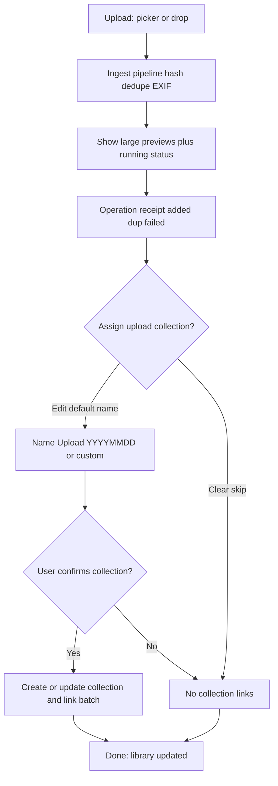
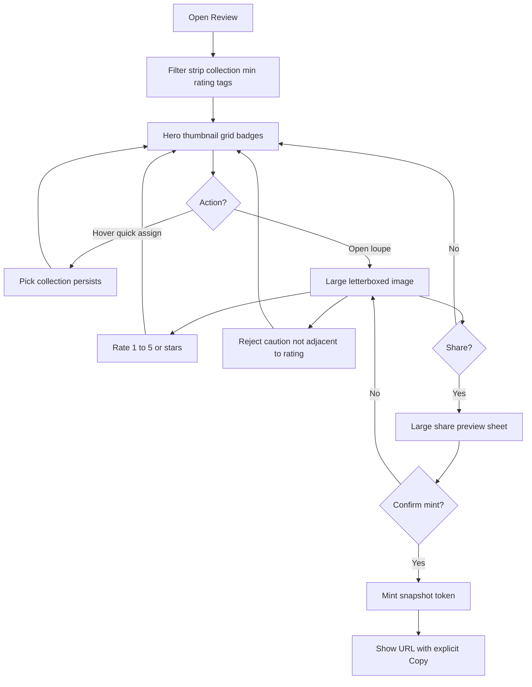
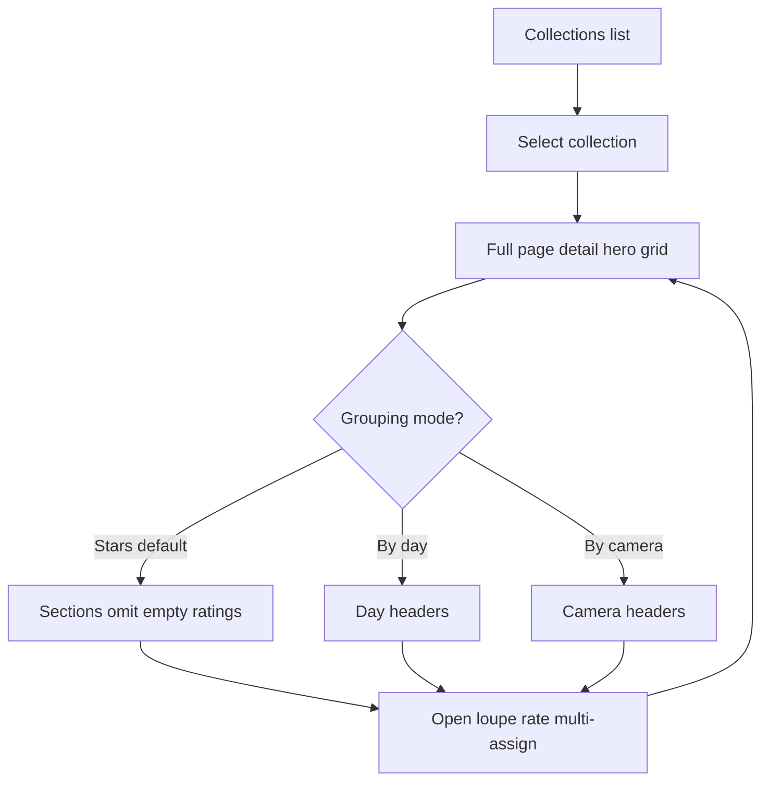
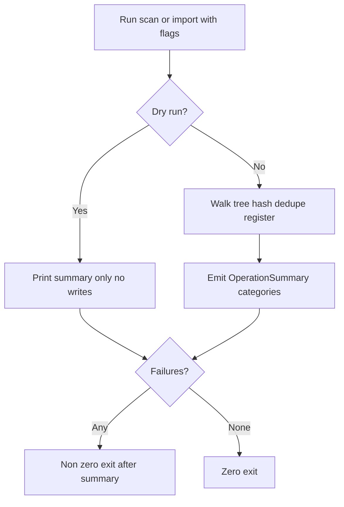
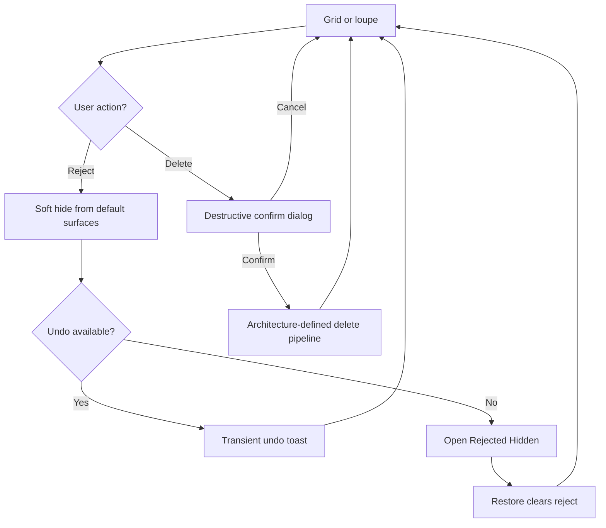
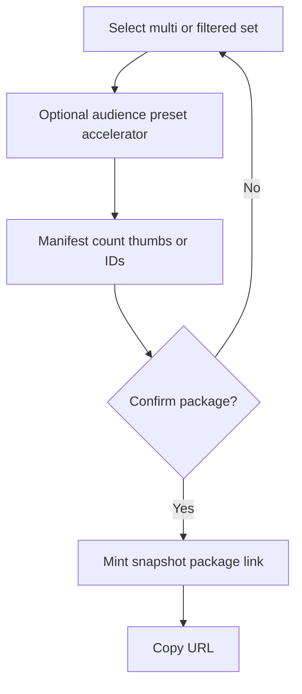

---
stepsCompleted:
  - 1
  - 2
  - 3
  - 4
  - 5
  - 6
  - 7
  - 8
  - 9
  - 10
  - 11
  - 12
  - 13
  - 14
lastStep: 14
workflowCompleted: '2026-04-14'
inputDocuments:
  - _bmad-output/planning-artifacts/PRD.md
  - _bmad-output/planning-artifacts/epics.md
  - _bmad-output/planning-artifacts/epics/README.md
  - _bmad-output/implementation-artifacts/1-2-capture-time-hash.md
  - _bmad-output/implementation-artifacts/1-3-core-ingest.md
  - _bmad-output/implementation-artifacts/1-4-collections-schema.md
  - _bmad-output/implementation-artifacts/1-5-upload-confirm-receipt.md
  - _bmad-output/implementation-artifacts/1-6-scan-cli.md
  - _bmad-output/implementation-artifacts/1-7-import-cli.md
  - _bmad-output/implementation-artifacts/1-8-drag-drop-upload.md
  - _bmad-output/implementation-artifacts/2-1-app-shell-navigation-themes.md
  - _bmad-output/implementation-artifacts/2-2-filter-strip.md
  - _bmad-output/implementation-artifacts/2-3-thumbnail-grid-rating-badges.md
  - _bmad-output/implementation-artifacts/2-4-review-loupe-keyboard-rating.md
  - _bmad-output/implementation-artifacts/2-5-tags-bulk-review.md
  - _bmad-output/implementation-artifacts/2-6-reject-undo-hidden-restore.md
  - _bmad-output/implementation-artifacts/2-7-delete-quarantine.md
  - _bmad-output/implementation-artifacts/2-8-collections-list-detail.md
  - _bmad-output/implementation-artifacts/2-9-collection-crud-multi-assign.md
  - _bmad-output/implementation-artifacts/2-10-quick-collection-assign.md
  - _bmad-output/implementation-artifacts/2-11-layout-display-scaling-gate.md
  - _bmad-output/implementation-artifacts/2-12-empty-states-error-tone.md
  - _bmad-output/implementation-artifacts/3-1-share-preview-snapshot-mint.md
  - _bmad-output/implementation-artifacts/3-2-loopback-http-token.md
  - _bmad-output/implementation-artifacts/3-3-share-html-readonly.md
  - _bmad-output/implementation-artifacts/3-4-share-privacy-wcag.md
  - _bmad-output/implementation-artifacts/3-5-share-performance-abuse.md
  - _bmad-output/implementation-artifacts/4-1-multi-asset-snapshot-packages.md
  - _bmad-output/implementation-artifacts/deferred-work.md
  - _bmad-output/implementation-artifacts/epic-1-retrospective-20260413.md
  - _bmad-output/implementation-artifacts/nfr-01-layout-matrix-evidence.md
  - _bmad-output/implementation-artifacts/nfr-07-os-scaling-checklist.md
---

# UX Design Specification photo-tool

**Author:** Sergejbrazdeikis
**Date:** 2026-04-14

---

<!-- UX design content will be appended sequentially through collaborative workflow steps -->

## Executive Summary

### Project Vision

**Photo Tool** is a **local-first** personal photo library: users bring images in through **desktop upload, drag-and-drop, or CLI scan/import**, get **honest batch receipts** (added, duplicates, failures), and store **one physical instance** per unique file with **capture-time-aware** folder layout and **deterministic deduplication**. The product centers on **fast triage and organization**—**ratings (1–5)**, **tags**, **collections** with explicit **confirm-before-create** rules for upload batches—and on **curatorial safety**: **Reject** **soft-hides** noise from default surfaces and from **share selection**, while **Delete** is a **separate, guarded, destructive** path. **Sharing** is **trust-first**: **preview and confirm before mint**, **snapshot** link semantics by default, **read-only** web review for recipients, and **privacy/accessibility** constraints on the share page (**no raw GPS** on the web; **WCAG 2.1 Level A**). **Growth** extends the same trust model to **multi-asset packages** with **manifest preview**. Implementation stories and NFR evidence already encode many of these as **UX-DR1–UX-DR15** and layout/scaling gates—this revision should keep **GUI and CLI** aligned on **meaning and summaries** wherever reject/ingest semantics apply.

### Target Users

**Primary:** Hobbyist and **semi-pro photographers** and **organizers** who manage **large local libraries**, care about **predictable on-disk structure**, want **bulk speed** (grid, filters, keyboard), and need to **reduce noise without default irreversible loss** (Reject) while still allowing **strong removal** when intentional (Delete). **Secondary:** **Power users** relying on **scan/import CLIs** for migration and reconciliation; **share recipients** on **desktop and mobile browsers** who must understand what they are seeing without installing the app.

### Key Design Challenges

- **Visual product identity (revision driver):** Photo Tool is **not** a **forms-first** or **control-dense** utility where **buttons, dropdowns, and chrome** dominate attention and **photos read as small accessories**. **Stakeholder direction (2026-04-14):** the **current app baseline is unacceptable**—**tiny thumbnails** with **persistent heavy UI** is the **wrong product**. This revision treats **large, always-primary imagery** as the **default bar**: in **upload**, **library/browse**, and **rating/single-photo** work, the **photograph must occupy the maximum practical window area**; secondary actions live in **thin strips, edges, overlays, or progressive disclosure**—never as the **visual center of gravity**.
- **Layout resilience:** Bulk review, filter strip, and **loupe** must keep **primary navigation and controls in view** from **square through ultrawide** and under **non-100% OS scaling**—this is both a product NFR (**NFR-01**, **NFR-07**) and a **Fyne implementation risk** called out in epic stories (**2-4**, **2-11**, evidence artifacts). **Reconciliation:** resilience rules must **not** be met by **shrinking** the image field; they require **smart chrome placement** and **responsive density**, not **postage-stamp grids**.
- **Safety and muscle memory:** **Reject** must stay **visually and spatially distinct** from **rating** and **Delete** (e.g. **Reject not adjacent to 1–5**); **undo/transient** feedback vs **Rejected/Hidden restore** must read as **one coherent recovery story** (**FR-29**, **FR-30**, **UX-DR5**, **UX-DR8**).
- **Trust at publish time:** **Share** flows must **block mint** until the user has **seen what will be shared**; **rejected** assets stay **out of default share paths**; web surface must not **leak sensitive metadata** or **fail basic accessibility** (**FR-32**, **FR-14**, **UX-DR7**, **UX-DR11–UX-DR12**).
- **Honesty at scale:** Ingest and scan/import must stay **streaming/chunked** for large trees, with **category-stable summaries** across **GUI and CLI** (**NFR-02**, **NFR-04**, stories **1-3**, **1-6**, **1-7**).
- **Backlog truth:** This UX revision must stay **reconcilable** with **named implementation artifacts** (e.g. empty states **2-12**, share stack **3-x**, deferred items) so design changes propose **clear story/AC deltas**, not silent drift.

### Design Opportunities

- **Image-forward redesign:** Treat **grid cell size**, **upload preview real estate**, and **loupe footprint** as **primary design variables**—stories that assume **small thumbs** or **panel-heavy** shells may need **AC updates** to match **hero imagery** and **minimal persistent chrome**.
- **Keyboard-forward curation:** Rating, navigation, and **deliberate Reject** as a **fast loop** with **capped undo** and an obvious **Rejected** home—turning “clear the junk” into a **confident ritual** rather than anxiety.
- **Receipts as brand:** Operation summaries after upload/scan/import that are **specific, countable, and consistent** with CLI output—users feel the system **is not hiding duplicates or failures**.
- **Collection-first browsing:** Full-page collection detail with **star/day/camera** grouping modes supports **album storytelling** before any sharing conversation.
- **Share that respects relationships:** Snapshot links and (Growth) **package manifests** reinforce **audience-appropriate slices** without forcing a **global “share everything”** model.
- **Polish where it hurts:** **Dual themes**, **empty states with one primary CTA**, and **proportionate error tone** (**UX-DR1**, **UX-DR9**, story **2-12**) compound into a product that feels **intentional** during long sessions.

---

**Discovery check-in:** If any of the above conflicts with how you want **v2** to feel (e.g. you are **narrowing MVP**, **changing share semantics**, or **deprioritizing CLI parity**), say so—the spec should track **your** bet, not only the last archive of the PRD/epics/stories.

## Core User Experience

### Defining experience

**Photo Tool is a visual product first.** Users come to **see and move through their pictures**, not to operate a **database panel**. In every primary mode—**ingest**, **browse / triage**, **collection viewing**, and **single-photo work**—the **photograph is the dominant object**: it uses **as much of the application window as practicable**. **Buttons, dropdowns, filter chrome, and metadata** are **supporting**; they must **not** be what the eye meets first, and they must **not** permanently consume the **center mass** of the window at the expense of **image pixels**.

The journey remains **ingest → cut noise and impose order → optionally publish a slice**, with **trust** (receipts, reject vs delete, preview-before-share) unchanged—but **layout priority flips** from “controls with thumbnails” to **“photos with controls.”**

1. **Ingest** — **Incoming images are the hero**: large previews or a **generous** preview grid—not a **form stack** with **postage-stamp** hints. Receipts (added / duplicates / failures) and **collection confirm** stay **compact** and **deferrable** (e.g. sheet, bottom strip, collapsible)—they **do not** shrink previews to **decorations**.
2. **Browse / triage** — The **image grid is the application surface**. Thumbnails are **as large as performance allows** for the window size; **rating, reject, and quick collection** read as **lightweight overlays or edge-attached** affordances—not a **wall of widgets** surrounding **tiny tiles**. **Filters** (**collection → minimum rating → tags**) use a **compact strip** or **collapsed** pattern; expanding filters uses **overlay / drawer / edge** behavior so **the grid regains maximum area** when not actively filtering.
3. **Organize (collections)** — **Collection detail** is **image-forward** like Review: **member photos** dominate; grouping (**stars / day / camera**) stays **subordinate** to the **image field**.
4. **Single-photo / rating** — The **active photo** fills **the maximum practical viewport** (the PRD **~90% loupe region** is a **structural floor** for “image wins,” not an excuse for **idle chrome**). **Letterbox** to show the **whole image**; **stars, reject, delete, share** sit **peripherally** and **must not** compete as equal visual weight with the **picture**.
5. **Share** — **Preview** shows the asset **large**; **Growth** packages use **manifest + large thumbnails**—**never** a list-first mint.

**CLI** remains **semantic parity** (dedup, dry-run, summary categories, exit rules per stories)—the **GUI** carries the **visual** promise; the **terminal** carries the **same trust in numbers and words**.

### Explicit anti-patterns (current baseline called out)

The following describe **what this revision rejects**—including the **current product feel** as of this writing:

- **Tiny thumbnails as the “main” UI** while **panels, dropdowns, and buttons** occupy most of the window.
- **Persistent dense chrome** (multi-column forms, large empty margins **around** small media) that makes the app feel like **settings with pictures attached**.
- **Rating flows** where **controls** draw more attention than the **photo**.
- **Upload** that prioritizes **transaction widgets** over **seeing what you are adding**.
- Treating **NFR-01 / layout matrix** as satisfied by **hiding** controls **off-screen** while **shrinking** imagery—**both** must hold: **visible essential navigation** **and** **hero imagery**.

### Platform strategy

- **Primary:** **Desktop (Go + Fyne)** — **macOS** / **Windows** tier-1; **Linux** tier-2. **Image canvas** is the **default layout anchor** for proportions, not the **menu chrome**.
- **Authority / share:** **Local library** is source of truth; **snapshot** links, **non-guessable tokens**, **loopback** default unless **deliberately** widened (per architecture/security).
- **Recipients:** **Read-only** browser view—**image dominant**; **WCAG 2.1 A**, **200% zoom**, **reduced motion**, **no raw GPS** on web.
- **Scale:** Large jobs may use **progress or batched logs** (**NFR-02**)—prefer **visual continuity** (e.g. **counts + thumbnails still visible**) over **log-first** full-screen takeovers unless the user **opts into** details.

### Effortless interactions

- **Hero image** in **upload**, **grid**, **collection detail**, and **loupe**—users never hunt for “where the photo went.”
- **Filters** and **metadata** **yield space back** to the grid when idle.
- **Receipts** after ingest: **clear numbers + plain language**; **secondary** to **large previews** unless expanded.
- **Share:** **large preview** → **explicit confirm** (no **accidental mint**) → **Copy**; **auto-copy** opt-in only.

### Critical success moments

- **During upload:** User **sees their photos large**; still trusts **duplicate/fail** truth.
- **During browse:** The **grid feels like the app**, not chrome around **flea-sized** media.
- **While rating:** The **photo** is what you **feel**; controls are **orbital**.
- **Ultrawide:** **Image stays hero**; **navigation** remains **in viewport** without **shrinking** photos below **reasonable minimum cell / loupe** targets (**quantitative thresholds** belong in a follow-on layout spec / story AC refresh).
- **Share mint + recipient open:** **Obvious large image**; **safe** metadata posture.

### Experience principles

1. **Image first, always** — **Upload, browse, triage, loupe, share preview:** the **picture is largest and most persistent**; everything else **supports**.
2. **Not a control panel with photos** — If the **first screenshot** reads as **buttons and dropdowns**, the layout has **failed** the charter.
3. **One library, many doors** — Upload, drop, scan, import: **same semantics**; **same summary language** GUI/CLI.
4. **Trust beats cleverness** — **Preview-before-publish**, **honest receipts**, **recoverable reject**; **Reject ≠ Delete**.
5. **Density with guardrails** — **Speed** without **hiding** reject/delete safety, **focus/publish safety**, or **errors**—badges **serve** the **large** grid; they **do not replace** it.
6. **Layout is product** — **Aspect + OS scaling** prove **hero imagery** **and** **reachable chrome** together.
7. **Recipients: smaller, safer, still visual** — **Read-only**, **accessible**, **privacy-bounded**—**photo still dominates**.

## Desired emotional response

### Primary emotional goals

Users should feel **immersed and photo-centered**: the **frame is the photo**; **chrome is quiet and predictable**—designers know **what recedes** (density and placement of controls), not which features disappear. The dominant feeling is **calm competence**: “**I see my work clearly; I can move fast without fear.**” Name the anti-pattern explicitly: **no spreadsheet anxiety**—rows of **tiny assets** and **dense controls** are what broke trust with the **current baseline**; this revision **rejects** that emotional read.

Secondary feelings: **relief** (duplicates and failures are **honest**, not mysterious); after triage aim for **resolution**—the stack feels **handled** (not only “lightness,” since personal libraries can carry **grief or ambivalence**, not just joy). For **sharing**, lead with **control** (what is included, how it reads to others); **pride** (“this is what I meant to show”) is **possible** but not universal—some users feel **exposure**; the UX must support **confident, bounded** sharing, not assumed delight.

The product should **not** feel like **admin software** or **a chore list with thumbnails**—**explicitly out of scope** for this revision.

### MVP vs Growth emotional priorities (draft)

- **MVP (must hold at launch):** **Confidence and clarity**—upload/ingest outcomes are **believable**, **orientation** to the next step is obvious, **errors** are **actionable**, **reject/delete/share** distinctions are **clear**. These emotions are **testable** with tasks, receipts, and error injection.
- **Growth / polish:** Deeper **immersion**, **single-focus rhythm**, and **sparing** non-gimmicky moments—**after** core journeys are **reliably completable**; otherwise “vibes” become **scope inflation** (see testability below).

### Intentional tension (when goals conflict)

When **image prominence**, **information density**, and **power features** collide, **default image prominence wins**: **reduce or progressive-disclose** chrome before **shrinking** the photo canvas—unless a **stakeholder decision** explicitly records a different trade (documented in PRD/story).

### Emotional journey mapping

| Stage | Desired feeling | What breaks it (to avoid) |
|-------|-----------------|---------------------------|
| **First session / empty library** | **Welcoming, unblocked**—clear **one** path to add photos, **large previews** immediately | Empty states that feel **technical** or **form-heavy**; tiny drop zones |
| **Orientation / wayfinding** | **“I know where I am”**—current **area** (Upload, Review, Collection, Rejected) and **what this view is for** without clutter | Getting **lost** in your own library; **orphan** screens; mystery meat nav |
| **Heavy import / scan** | **Grounded**—**visible progress** on **photos**, not abstract spinners only | Log-first UI; **silent** partial failure; **disappearing** previews |
| **Failure / recovery** | **Reassurance**—cause + next step; **nothing bad happened** (or **honest** consequence) after errors, disk issues, or “where did it go?” | Dead ends; **blamey** copy; **hiding** partial failure |
| **Core triage (grid + loupe)** | **Single-focus rhythm**—**low cognitive load**; eyes on **images**, hands on **keyboard**; steady pace (**not** promising frictionless “flow” as an untestable bar) | **Flea-sized** tiles; **control soup**; **lost menus** on ultrawide |
| **Reject / hide noise** | **Safe clearing**—“**gone from my day, not gone from my life**” | Reject that **feels like delete**; **unfindable** recovery |
| **Delete** | **Solemn intentionality**—rare, **clear consequence** | Casual or **mis-tappable** destructive actions |
| **Organize (collections)** | **Ownership**—albums as **places** that feel **yours** | Modals that feel **temporary** or **detached** from the grid |
| **Share mint** | **Confident publish**—**control** over what ships; preview matches **recipient reality** | **Ambiguous** preview; **tiny** share image; **accidental** mint |
| **Recipient opens link** | **Dignity + safety**—**photo first**, respectful surface; no **creepy** metadata | Walls of EXIF; **slow** or **broken** focus; **location** exposure |
| **Return visit** | **Familiar continuity**—**themes**, **predictable** nav, **trust** in last session’s work | **Surprise** layout shifts; **inconsistent** labels or summaries |

### Micro-emotions

Each cluster should tie to **events** (load, empty state, success, long wait, error, risk action) so UX and eng can trace **when** the system must behave.

- **Confidence over confusion** — Users **know** library state (**counts**, **where files live**, **what reject means**). **Confusion** is a **failure mode** for **personal** media.
- **Trust over skepticism** — Receipts, **preview-before-share**, **CLI/GUI parity** prevent **“is it lying?”**
- **Calm focus over anxiety** — Large imagery and **peripheral** chrome reduce stress from **small targets** and **dense panels** (the **baseline** to design away from).
- **Reassurance after risk** — After **reject**, **delete confirm**, **share mint**, or **error recovery**: explicit **“you’re OK”** or **honest** outcome—**not** cute; **clear**.
- **Accomplishment over frustration** — **Visible** progress at session end (**sorted grid**, **link copied**) vs **unfinished** business.
- **Delight (sparing, bounded)** — **Specific** moments only: e.g. **clear confirmation without noise**, **smooth** loupe transitions (**reduced motion** respected), **crisp** empty states—**cap scope**; no **delight everywhere**.
- **Agency over isolation** — **Local**, **under your hand**—not **anonymous cloudware**.

### Design implications

- **Immersion** → **Maximize image canvas**; **collapse** or **edge-dock** secondary UI; **avoid** permanent **half-window** panels that shrink photos **by default**.
- **Orientation** → **Visible** place in app + **state** that matches reality; wayfinding **without** reclaiming the **hero** image area by default.
- **Calm competence** → **Predictable** navigation; **consistent** **GUI/CLI** summary language; **themes** that **reduce glare** in long sessions.
- **Relief on ingest** → **Large previews** with **plain-language** receipts; duplicate/failure lines **visible**, not buried.
- **Safe clearing** → **Reject** = caution; **Rejected/Hidden** **discoverable**; **Delete** = destructive + confirm.
- **Confident share** → **Large preview**; **explicit confirm** (no **single-keystroke mint**); **snapshot** clarity; **rejected** blocked on default path.
- **Recipient dignity + safety** → **Image-dominant** page; **WCAG 2.1 A**; **no raw GPS**; **neutral** alt—**respectful** sharing, not just **compliance** checkboxes.

### Testability and traceability

Emotional goals need an **observable bridge**—otherwise they are **not** acceptance criteria. Pattern: **emotional outcome → user-visible behavior → FR/NFR/story reference → verification** (task test, layout checklist, error injection, perf budget). Examples (exact thresholds like **X%** viewport belong in **layout AC / NFR**, not invented here):

- **Calm competence / empty library:** primary path + next action **visible** without burying **large** imagery; verify with **task test** + screenshot matrix.
- **Image prominence:** loupe/grid targets per **NFR-01** / layout stories; verify at **breakpoints** and **OS scaling**.
- **Recovery:** on ingest/share failure, **cause + next step** in plain language, **no** dead end—**error injection** tests.
- **“Come back without dread”:** tie to **low cognitive debt**—work **honestly surfaced** (receipts, queue, failures), **no hidden backlog**; verify with **session return** tasks and **summary consistency**.

**Follow-on artifact (recommended):** an **emotion → AC** table and **traceability** column on key FRs/NFRs (**emotion tag** + **verification method**). **Party Mode (2026-04-14)** flagged **metrics** (task success, time-to-first-useful-view, retry after failure, 7-day return) as **product discipline**—assign in sprint planning, not only in this doc.

### Stakeholder lenses (emotional requirements)

| Lens | Emotional intent |
|------|------------------|
| **Accessibility** | **Calm** under **zoom, contrast, keyboard, screen reader**—predictable **focus order**, **non-alarming** announcements; a11y is not “extra,” it is **part of** calm competence. |
| **Privacy / security** | **Confidence** about **where photos go** and **what links expose**; testable copy and states for share/delete/reject. |
| **Performance / reliability** | **Immersion breaks** on **stalls**—latency and **offline** behavior are emotional requirements; align with **NFR-02**, **NFR-05**. |
| **Support / ops** | Reduce **helplessness**: **actionable** errors, optional **error identity** for logs/docs where product allows. |

### Emotional design principles

1. **The feeling is “my photos,” not “the app.”** If users narrate the session as **fighting the UI**, we have **lost** the emotional target.
2. **Honesty is kindness.** **Hidden** failures and **ambiguous** share state create **anxiety**; **explicit** outcomes create **calm**.
3. **Size is respect.** **Small thumbnails** read as **dismissive**; **hero imagery** reads as **taking the work seriously**.
4. **Power without peril.** **Speed** must not **trade away** **recoverability** (reject), **clarity** (delete), or **certainty** (share).
5. **Emotion scales with stakes.** **Delete** and **share** get **quieter, weightier** moments; **rating** stays **light** and **immediate**.
6. **Come back tomorrow without dread.** **Continuity** and **trust** in what the app **remembers** and **shows**—tied to **honest surfacing** of work and outcomes (**low cognitive debt**).
7. **Rank feelings like features.** If it has **no** observable proxy or **owner**, it is **aspiration** or **backlog hypothesis**—not a **launch gate**.

## UX pattern analysis and inspiration

*Inspiration sources below are **category landmarks** inferred for hobbyist/semi-pro organizers managing **large local libraries**—not a claim that Photo Tool will clone any product. Use them for **pattern vocabulary** and **trade-off awareness**; final UI must respect **Fyne**, **Go**, and **this spec’s image-first charter**.*

### Inspiring products analysis

**Apple Photos (macOS / ecosystem)** — **Strengths:** **Full-bleed** and **large-tile** browsing; **moments** and **albums** feel **media-first**; **simple** share sheet mental model for non-pro users. **Less transferable:** **cloud-centric** assumptions; **less** emphasis on **honest ingest receipts** and **CLI parity**—we keep our **local-truth** and **operator** story.

**Adobe Lightroom Classic–style library (desktop DAM pattern)** — **Strengths:** **Grid-first** culling; **keyboard-driven** rating/flagging culture; **collections** as **first-class** organizational objects; users expect **dense productivity** **without** losing **which photo is selected**. **Less transferable:** **Steep** surface area and **module** complexity—our MVP should **not** import **panel sprawl**; steal **rhythm** and **keyboard loop**, not **chrome count**.

**Google Photos (consumer web/mobile pattern)** — **Strengths:** **Large thumbs**, **low-friction** browsing, **obvious** primary content; **sharing** feels **lightweight** (with product-specific trust models). **Less transferable:** **Server-side** magic; **we** must implement **preview-before-mint**, **snapshot** semantics, and **rejected** rules **explicitly**—not assume **cloud** affordances.

**digiKam / darktable / libre catalog tools (power-user open ecosystem)** — **Strengths:** **Local-first**, **serious** metadata and **folder** discipline; **proof** that **keyboard** and **batch** workflows matter. **Caution:** Many UIs skew **inspector-heavy** or **small-thumb** defaults—useful as **anti-pattern** reference for **our** revision (**control soup**).

### Transferable UX patterns

**Navigation**

- **Persistent, low-height primary nav** (Upload / Review / Collections / Rejected) with **predictable order**—mirrors “**I always know where I am**” without eating the **grid**.
- **Full-page collection detail** (not **modal stacks** for main browsing)—supports **ownership** and **image-forward** browsing.

**Interaction**

- **Loupe / single-photo mode** that **reserves maximum canvas** for the **image**; **peripheral** rating, **reject**, **nav**—matches **single-focus rhythm**.
- **Keyboard-first triage** (**1–5**, arrows, deliberate **reject** away from rating)—matches **semi-pro** muscle memory from DAM culture.
- **Progressive disclosure** for **filters** and **metadata**—**overlay / drawer / collapse** so **grid regains** area when not editing filters.

**Visual**

- **Dark or neutral chrome** option so **photos pop** (already aligned with **dual themes**); **destructive** and **reject** semantics use **consistent** color roles—not **decorative** noise.
- **Receipts and errors** as **compact** **secondary** surfaces after **ingest**—**large previews remain** visible (relief + honesty).

**Share / recipient**

- **Large preview before publish** and **explicit confirm**—analogous to **careful** share flows users trust in **mature** consumer apps, adapted to **local snapshot** + **loopback** architecture.

### Anti-patterns to avoid

- **Inspector-default layouts** where **metadata panels** dominate and **thumbnails** shrink to **postage stamps**—directly conflicts with **image-first** and **“not admin software.”**
- **Modal layering** for **core** browse and **organize**—creates **disorientation** and **detached-from-grid** feeling.
- **Share** paths that **mint** or **copy** before **clear asset identity**—breaks **confident publish** and **recipient dignity**.
- **Hiding** ingest outcomes (**duplicates**, **failures**) behind **technical** logs—breaks **trust** and **calm competence**.
- **Delight** sprawl (animation, sound, mascot) **without** **stop rules**—John/Mary party feedback: **bounded** delight only.
- **Assuming “flow state”** as MVP bar—prefer **testable** **low cognitive load** and **task success**.

### Design inspiration strategy

**Adopt**

- **Large-tile / hero grid** defaults and **maximum loupe canvas**—core to **revision** direction.
- **Keyboard culling loop** patterns where they **do not** require **adjacent reject** to **rating** keys.
- **Progressive disclosure** for **filters** and **secondary metadata**—protects **image prominence** when idle.

**Adapt**

- **Lightroom-style density** → **Photo Tool** **density** with **fewer** persistent panels; use **Fyne** constraints to implement **orbital** controls, not **Photoshop-style** docks.
- **Consumer share simplicity** → **local snapshot** + **WCAG A** + **no raw GPS** on web; **more** explicit steps than **one-tap** cloud share.

**Avoid**

- **Cloud-only** mental models for **organization** and **trust** (silent sync, ambiguous canonical copy).
- **Panel-first** DAM complexity in **MVP** chrome—reserve **power** for **keyboard** and **focused** screens, not **parallel** inspectors.
- **Tiny thumbnails** as the **default** success criterion for “we shipped a grid.”

**Uniqueness:** Photo Tool’s **differentiator** remains **unified ingest + scan/import**, **reject vs delete** semantics, **GUI/CLI parity** on summaries, and **preview-before-mint** **local** sharing—**inspiration** informs **layout and rhythm**, not **feature cloning**.

## Design system foundation

### 1.1 Design system choice

**Hybrid: Fyne-native UI + project semantic token system + minimal web tokens for share pages.**

- **Desktop (primary):** Use **Fyne** as the **component runtime** (widgets, layout, themes). Do **not** adopt a **web-first** design system (Material, MUI, Chakra, Tailwind component libraries) for the **desktop shell**—they do not map 1:1 to Fyne and invite **wrong** interaction models. Instead, treat Photo Tool as having a **small custom design system**: **two peer themes** (**dark default**, **light**) driven by a **single semantic role table** shared across the app (**UX-DR1** in epics).
- **Share viewer (secondary):** **`html/template` + static CSS** per architecture/PRD. Use a **minimal token subset** (**background, surface, text, focus, link**) **aligned by name** with desktop semantics so **brand and danger/reject** cues do not diverge wildly between app and link page.

### Rationale for selection

- **Technical fit:** The product is **Go + Fyne** on **macOS / Windows / Linux**; the design system must be **what Fyne can render and theme** reliably—not a parallel web kit.
- **Image-first charter:** Success is **maximum canvas for photos** and **quiet chrome**; a **large external** web design system tends to **pull** toward **dense controls** and **component showcase** layouts. A **thin, documented** token + pattern layer keeps **layout decisions** in product hands.
- **Accessibility split:** **WCAG 2.1 Level A** applies to the **share page**; **desktop a11y** is **Fyne- and platform-dependent**—document **focus visibility**, **keyboard order**, and **contrast** targets in **QA** (e.g. **UX-DR15**, **NFR-01** / **NFR-07**), not by importing a **web** a11y kit wholesale.
- **Maintenance:** Fewer **third-party** UI dependencies on desktop reduces **upgrade risk**; **web** stays **small** and **auditable** for **privacy** and **performance** (**NFR-05**, **NFR-06**).

### Implementation approach

1. **Semantic roles (desktop)** — Maintain one table (code or doc) mapping **roles** → **Fyne theme colors / styles**: at minimum **background**, **surface**, **primary**, **text primary**, **text secondary**, **focus**, **destructive** (delete), **reject / caution**, **border / separator**. **Both** themes implement **all** roles so features do not **only** work in dark mode.
2. **Components as patterns** — Reuse Fyne primitives (**Button**, **Select**, **Entry**, **List**, **Scroll**, **Modal** or custom `fyne.CanvasObject` layouts) with **named wrappers** only where needed (**filter strip**, **thumbnail cell**, **loupe chrome**, **share preview sheet**) to enforce **spacing**, **focus**, and **role** usage consistently.
3. **Typography and density** — Start from **Fyne defaults**; adjust **padding/margins** downward only when **image area** gains space—never **below** **readable** tap/click and **focus ring** visibility. **OS scaling** (**NFR-07**) validates **legibility**, not just raw pixels.
4. **Web share CSS** — Single **small** stylesheet (or scoped blocks) using **CSS variables** mirroring semantic roles; **no** raw GPS panels; **focus** and **contrast** checked against **WCAG A** targets (**UX-DR11–UX-DR12**).
5. **Icons and badges** — Use **consistent** shapes/colors for **rating**, **reject**, **failed decode**, **duplicate** summary—tied to **roles**, not **one-off** hex values in scattered files.

### Customization strategy

- **Brand:** Photo Tool is **utility-forward**, not **marketing-flashy**; “brand” = **predictable** **semantic** colors + **calm** typography + **photo-forward** layout. Optional **accent** only where it **aids** orientation (e.g. **primary** for **active nav**), not **decorative** noise.
- **Image-first overrides** — When **layout** fights **token defaults** (e.g. default Fyne **padding** eats grid), **prefer** **layout templates** that **shrink chrome** before **shrinking thumbnails**—consistent with **intentional tension** in **Desired emotional response**.
- **Destructive / reject** — **Never** style **Reject** like **Delete**; **never** place **Reject** **adjacent** to **1–5** in **keyboard** or **visual** grouping (**UX-DR5**).
- **Future:** If the project adds **more** web surfaces, **extract** shared **tokens** to a **single source** (generated Go constants + CSS variables) to avoid **drift**—out of scope until a second web flow exists.

**Review cadence:** When adding a **new surface** (e.g. Growth package UI), check **role coverage** and **focus order** before **shipping**—treat as **design-system** change, not **one widget** tweak.

## 2. Core user experience

*This section drills into the **single defining interaction** that should make Photo Tool feel unmistakable. It **extends** the earlier **Core User Experience** (product-level loop and principles) with **mechanics** and **success criteria** focused on what users would describe to a friend.*

### 2.1 Defining experience

**The one-line story:** “**I move through my library with the photo huge on screen—rate, hide junk, and sort into albums—without fighting a panel full of buttons or flea-sized thumbnails.**”

**The defining interaction:** **Hero-image triage**—a **tight loop** of **(1)** seeing each photo **as large as the window allows**, **(2)** committing **state** (**rating**, **tags**, **reject**, **collections**) with **minimal context switch**, and **(3)** **trusting** that **ingest** and **batch tools** tell the **truth** (**duplicates**, **failures**, **same words as CLI**). If this loop feels **fast, calm, and visual**, the product wins; if it feels like **admin software**, the product loses—regardless of feature count.

**Secondary but coupled loop:** **Honest ingest**—**large previews** while adding photos plus **plain receipts**—because distrust at import **poisons** every later triage session.

### 2.2 User mental model

- **Users think in pictures, not rows.** They expect **the artifact** (the **image**) to be **the interface’s center of gravity**, like a **light table** or **contact sheet**, not a **database grid** where the **row chrome** matters more than the **thumbnail**.
- **“My files, my disk.”** **Local-first** operators expect **predictable** paths, **dedup** that **matches intuition** (same bytes = one copy), and **no silent magic** that hides **failures** or **duplicates**.
- **Reject vs delete** must match **emotional reality:** **Reject** = “**not part of my working set**” (recoverable, hidden); **Delete** = “**I meant to remove**” (guarded, heavier)—users **import** this from **email** and **file managers**; **conflation** creates **anxiety**.
- **Share** is **publication**, not **sync**—they expect **preview** and **a fixed slice** (**snapshot**), not **surprise** changes for recipients.
- **Confusion hotspots:** **tiny thumbs**, **lost chrome** on ultrawide, **unclear** duplicate outcomes, **ambiguous** share targets, **reject** that **feels like erase**.

### 2.3 Success criteria

- **Visual dominance:** In **Review** and **loupe**, the **photo** occupies **the maximum practical area**; **chrome** is **peripheral**—validated by **layout matrix** and **stakeholder screenshot** test (“**does this look like buttons-with-photos?**” → fail).
- **Speed of commitment:** **Rating** and other **frequent** actions persist within the **PRD** guideline (**~1s** local single-user) and **reflect immediately** on **grid badges** and **loupe**.
- **Honest closure:** After **upload/scan/import**, user can **state** what happened (**added / duplicate / failed**) and **where** new files live—**GUI** matches **CLI** categories when the operation class overlaps.
- **Safety clarity:** **Reject** removes from **default** views and **share selection** but remains **recoverable** from **Rejected/Hidden**; **Delete** requires **confirm** and **destructive** styling—**no** **mis-tap** pattern next to **1–5**.
- **Share confidence:** **No token/URL** until **preview + confirm**; **rejected** not shareable on **default** path; recipient page **image-first**, **WCAG A**, **no raw GPS**.
- **Orientation:** User can **name** where they are (**Upload / Review / Collections / Rejected**) without **hunting**—supports **calm competence** from **Desired emotional response**.

### 2.4 Novel UX patterns

- **Mostly established:** **Thumbnail grid + full-screen/loupe viewer**, **keyboard numerals for rating**, **filters** (collection → min rating → tags), **collections** as **containers**—users **already know** these from **photo managers** and **DAM-style** tools.
- **Differentiators (product-specific twists):** **Unified** upload + scan/import **semantics**; **Reject** as **first-class** **soft-hide** with **CLI/GUI** **aligned** summaries; **local snapshot** share with **loopback** default and **preview-before-mint**; **explicit** **Growth** path for **packages** with **manifest preview**.
- **Education burden:** **Low** for grid/loupe; **medium** for **Reject vs Delete** and **snapshot share**—address with **copy**, **styling**, **confirm** steps, and **empty states**, not **tutorial walls**.

### 2.5 Experience mechanics

**A. Initiation (enter triage)**

- User opens **Review** from **primary nav**; **filter strip** shows **defaults** (**no assigned collection**, **any rating**) unless **remembered** per product rules.
- Optional: user applies **filters** (**collection**, **min rating**, **tags**) via **compact strip**; expanded filter UI **yields** space back to **grid** when dismissed.

**B. Interaction (core loop)**

1. **Scan grid** — **Large** thumbnails with **visible** **rating / reject / decode** state; **hover or equivalent** **quick** collection assign per **FR-08**.
2. **Open loupe** — **Click** or **keyboard** opens **single-photo** view: image **letterboxed** in **~90%** region; **primary chrome** remains **in viewport** across **1:1–21:9** (**NFR-01**).
3. **Commit state** — **1–5** or **stars** for **rating** (no extra confirm); **Reject** and **Delete** use **distinct** **controls** and **keyboard** bindings (**Reject not adjacent to 1–5**); **tags** and **multi-collection** assign per **PRD**.
4. **Navigate** — **Prev/next** (**arrows**, **keys**, **swipe** where supported) **without** closing **loupe**; **focus order** targets **filter strip → grid → loupe** for **keyboard** users (**UX-DR15** intent).

**C. Feedback**

- **Immediate** **badge/state** updates on **grid** and **loupe** after **rating/reject**; **transient undo** for **reject** where architecture allows (**UX-DR8**).
- **Errors** (**decode**, **IO**) show **cell-level** or **inline** **honest** states—**no** silent **holes**.

**D. Completion**

- **Session-level:** User **closes** loupe or **navigates** away with **visible** **progress** (**sorted** set, **fewer** unrated, **rejects** **cleared** from default).
- **Ingest-level:** **Receipt** **summarizes** operation; user **dismisses** or **drills into** details **without** losing **large** **preview** context on **first** success paths.

**E. Parallel path (share from loupe)**

- **Share** opens **large preview sheet** → **confirm** → **mint** → **Copy** URL (**auto-copy** opt-in only); **rejected** **blocked** on **default** flow.

**Next in workflow (BMAD):** **Step 8 — visual foundation** (color, type, spacing intent beyond tokens already chosen).

## Visual design foundation

*No separate **marketing brand book** is assumed for Photo Tool; visual direction follows **emotional goals** (**calm competence**, **image-first**) and **Design system foundation** (Fyne **semantic roles**, dual themes). **Hex values** belong in **theme code** or a **token file**—this section defines **strategy** and **constraints**.*

### Color system

- **Themes:** **Dark** (default) and **Light** as **peers**—both **complete**; no **light-mode-afterthought** controls or **missing** **destructive/reject/focus** roles in either.
- **Semantic mapping (minimum roles):** **background**, **surface** (raised cards/panels), **primary** (key actions, active nav), **text primary**, **text secondary**, **border/separator**, **focus** (keyboard), **destructive** (**Delete**), **reject/caution** (**Reject**, non-destructive hide), **success** (optional—for **receipt “added”** emphasis), **warning** (optional—long operations). **Photos** sit on **surface/background** neutrals that **do not** compete with **sRGB** image saturation—avoid **neon** chrome.
- **Emotional palette:** **Restrained**—**calm** grays/neutrals + **one** disciplined **primary** accent; **reject** and **delete** are **distinct** hues or **weight**, not **same red**.
- **Contrast:** **WCAG 2.1 Level A** for **share page** text/UI; **desktop** targets **readable** body and **visible focus** on **both** themes at **100%** and **125%/150%** OS scaling (**NFR-07**). Validate **rating badges** and **secondary text** on **varied** photo **thumbnails** (light/dark images behind **semi-transparent** overlays if used).
- **Imagery:** Prefer **neutral** **matte** chrome so **user content** carries **color**; **do not** **tint** the **loupe** image region.

### Typography system

- **Desktop:** **Fyne / platform system fonts**—no **custom** webfont **requirement** for MVP; **consistency** beats **brand novelty** for a **utility** product.
- **Tone:** **Professional, quiet, legible**—**short** labels (**nav**, **filters**, **buttons**), **scannable** receipts; **no** long-form reading **surface** except **help/errors**.
- **Hierarchy:** **Three** practical levels: **window/nav title**, **section label**, **body/caption** (grid metadata, receipt lines). **Avoid** **excessive** **sizes**—**pixels** belong to **photos**.
- **Density:** **Slightly compact** **chrome** text to **return** area to **grid/loupe**; **never** **below** **minimum** comfortable **reading** at **target** OS scaling.
- **Share page:** **System font stack** in CSS; **line length** short; **headings** only for **page title** / **error**—**image** remains **hero**.

### Spacing and layout foundation

- **Base unit:** **8px** mental model (Fyne **padding** may use **half/double**—document **in code** as **constants**). **Inset** **nav** and **strips** with **multiples** of base; **loupe** **image margin** **minimal**—**outer** **breathing room** only where **focus rings** and **window resize** need it.
- **Density stance:** **Efficient** **chrome**, **generous** **media**—**inverse** of **current** **tiny-thumb** baseline; when **in doubt**, **shave** **panel** padding **before** **cell** size.
- **Grid:** **Fluid columns** by **window width**; **minimum** **cell** size **floor** set in **layout AC** (see **testability** notes)—**grow** cells when **width** allows; **avoid** **fixed** **tiny** columns on **large** displays.
- **Loupe:** **Center-weighted** image; **controls** **orbit** (**top/bottom** bar or **overlay** with **safe** **hit targets**); **arrows** **mid-height** at **image** edge per **PRD**.
- **Z-order / layers:** **Filters** **drawer/overlay** **above** grid **without** **persistent** **resize** of **image** area when **closed**.

### Accessibility considerations

- **Share page (mandatory):** **WCAG 2.1 Level A**—**focus** visible, **labels** for **controls**, **contrast** for **text** and **UI**, **keyboard** operability; **200% zoom** **primary** path usable (**UX-DR12**); **`prefers-reduced-motion`** for **non-essential** motion (**UX-DR12**).
- **Desktop:** **Focus visibility** on **all** **interactive** **defaults**; **predictable** **tab order** (**filter strip → grid → loupe** intent); **do not** **rely** on **color alone** for **rating/reject** (**shape/icon/text** **redundancy** where feasible).
- **Motion:** **Respect** system **reduced motion** for **loupe** transitions and **toasts**.
- **Alt text (share):** **Neutral** policy (e.g. **“Shared photo”**) unless **owner** caption exists—**no** **auto** filename/EXIF **dump** (**UX-DR11**).

## Design direction decision

### Design directions explored

Six **layout directions** are captured as **low-fidelity wireframes** (HTML) for **chrome vs. photo** balance—not pixel-perfect Fyne. Open in a browser:

`_bmad-output/planning-artifacts/ux-design-directions.html`

| ID | Direction | Intent |
|----|-----------|--------|
| **A** | **Minimal top nav + collapsible filter strip + hero grid** | **Default recommendation**—grid is the app; filters yield space. |
| **B** | **Narrow left rail + wide grid** | Maximum horizontal grid; validate **focus order** and **Fyne** rail ergonomics. |
| **C** | **Edge-to-edge grid + floating filter chip** | Strong immersion; needs **obvious dismiss** and **keyboard** path to filters. |
| **D** | **Loupe split: main stage + filmstrip** | Single-photo **hero** with context strip; watch **ultrawide** chrome rules. |
| **E** | **Ingest-first: large previews + compact receipt** | Upload/scan **emotion**—previews dominate, receipts secondary. |
| **F** | **Pro density: more cells, no inspector wall** | More thumbs **without** permanent metadata panel—**floor** cell size in **AC**. |

**Evaluation criteria used:** layout intuitiveness, interaction style, visual weight, navigation fit, journey support, emotional alignment (**calm**, **not admin UI**).

### Chosen direction

**Primary (v2 spec default): Direction A — minimal top navigation, collapsible/compact filter strip, hero thumbnail grid.**  
**Secondary references:** **E** for **ingest** surfaces; **D** for **loupe** composition (main stage + contextual strip); **B** as a **future** variant if **top bar** feels heavy in **Fyne** testing.

**Status:** **Locked as design intent** pending **usability / NFR-01 matrix** validation; **combine** elements (e.g. **A** + **D** loupe layout) as implementation proves necessary.

### Design rationale

- Aligns with **stakeholder** mandate: **photos largest**, **not** **buttons-and-dropdowns-first**.
- **Progressive disclosure** for filters matches **transferable patterns** (Step 5) and **intentional tension** (image prominence **wins** over default chrome).
- **Conservative** on **C** (full floating chrome)—higher **discovery** risk for **filters** and **a11y** unless carefully built.
- **F** remains available for **power** users only if **minimum cell** and **OS scaling** tests pass—never as **default tiny-thumb** baseline.

### Implementation approach

- **Prototype in Fyne** with **Direction A** for **Review** + **Collection detail**; measure **grid cell size** vs. **window** at **1024–5120** widths and **125%/150%** scaling.
- **Loupe:** adopt **D-like** **orbit** controls + **letterboxed** main stage per **PRD**; **filmstrip** optional if it **does not** shrink **main** image below charter.
- **Upload:** apply **E-like** **preview-first** layout; **receipt** **collapsible** after first success path.
- **HTML file** is **communication** artifact for **stakeholders**; **source of truth** remains this spec + **stories**—update **AC** when a **direction** mix is chosen per screen.

## User journey flows

*Flows extend **PRD user journeys** (A–F) with **screen-level** intent, **decision points**, and **recovery**. **Direction A/E/D** inform layout: **hero grid**, **large ingest previews**, **loupe-forward** share. Diagrams are **Mermaid**—render in a Mermaid-capable viewer if needed.*

### Journey A — Bulk import and optional collection

**Goal:** Add many photos with **honest outcomes** and **optional** batch collection—**no** surprise albums (**FR-01–FR-06**).

**Flow notes:** **Large previews** during/after ingest (**Direction E**); **receipt** always visible; **confirm** is the **only** gate to **persist** collection (**FR-06**).

**Recovery:** Partial failures **listed** on receipt; **retry** or **fix source** paths **plain-language**; **no** silent partial success.

---

### Journey B — Bulk review, rating, and single-photo share

**Goal:** **Triage** at speed with **keyboard**; **share** only after **large preview** + **confirm** (**FR-07–FR-14**, **FR-32**, **FR-29**).

**Flow notes:** **Filter strip** defaults **no collection / any rating**; **loupe** uses **maximum** image area; **rejected** **blocked** from default share.

**Edge cases:** **Rejected** asset → **block** default share path → user must **restore** or use **Rejected** view intentionally. **Decode failure** → **cell state** + explanation, not blank tile.

---

### Journey C — Browse by collection

**Goal:** **Albums** as **places**—**full-page** detail, grouping by **stars / day / camera** (**FR-15–FR-25**, **FR-21**).

---

### Journey D — Scan or import existing disk (CLI)

**Goal:** **Power users** reconcile trees with **dry-run** and **GUI-aligned** summaries (**FR-27–FR-28**, **NFR-04**).

*GUI parity:* **Same category labels** as **upload receipt** where operation class matches.

---

### Journey E — Reject, delete, and recovery

**Goal:** **Safe clearing** vs **intentional removal**; **recoverable** reject (**FR-29–FR-31**).

---

### Journey F — Sharable package (Growth)

**Goal:** **Multi-asset snapshot** with **manifest preview**; **presets never replace preview** (**FR-33**).

---

### Journey patterns

- **Primary nav anchor** — **Upload / Review / Collections / Rejected** in **fixed order**; **orientation** before **task depth**.
- **Confirm-before-persist** — **Collection** from upload batch; **Delete**; **Share mint**—**three different** “commit” families with **distinct** styling.
- **Preview-before-publish** — **Share** and **Growth package** always **show** what recipients get **large** where possible.
- **Honest batch closure** — **Receipt** or **CLI summary** ends **ingest-class** jobs; **failures** **addressed**, not **hidden**.
- **Progressive disclosure** — **Filters** and **metadata** **yield** canvas to **grid/loupe** when not active.
- **Recovery always drawn** — **Reject** has **undo** and/or **Rejected**; **errors** have **next step** copy.

### Flow optimization principles

1. **Minimize steps to first large photo** — **Empty library** and **post-upload** should **show** **big** imagery **before** deep forms.
2. **One focal task per screen** — **Triage** = **grid/loupe**; **avoid** **inspector + tiny grid** defaults.
3. **Reduce decision points at commit** — **Share** and **Delete** use **explicit** confirm; **rating** stays **one action**.
4. **Feedback proportional to stakes** — **Receipt** detail expandable; **rating** **instant** badge update.
5. **Error paths are emotional paths** — **Failure / recovery** rows in **Desired emotional response** apply: **plain language**, **no dead ends**.

## Component strategy

*Stack: **Fyne** primitives + **semantic tokens** (**Design system foundation**). **UX-DR1–UX-DR15** (epics) name the **product-specific** patterns below. **Custom** here means **composed layouts and behaviors**, not necessarily **new widgets**—prefer **thin wrappers** over **forking** Fyne internals.*

### Design system components

**Available from Fyne / platform (foundation):**

- **Controls:** `Button`, `Label`, `Entry`, `PasswordEntry`, `Select`, `Check`, `RadioGroup`, `Slider`, `Hyperlink`, `RichText` (where used).
- **Structure:** `Box`, `Border`, `Grid`, `Form`, `Scroll`, `Split`, `AppTabs` / custom tab row if needed, `Card` (if version supports) or **bordered container** pattern.
- **Windows / layers:** `Dialog`, `PopUp`, `Modal` patterns, `Window` toolbar areas.
- **Theme:** `fyne.Theme` implementation mapping **semantic roles** → **colors**, **sizes**, **fonts** (**UX-DR1**).

**Gaps (require composed “product components”):** **filter strip**, **thumbnail cell**, **loupe layout**, **operation receipt**, **share preview sheet**, **empty state block**, **collection row / section header**, **drag-drop target**, **tag editor** (bulk), **package manifest** (Growth).

---

### Custom components

#### Primary navigation shell

- **Purpose:** **Orientation** (**Upload / Review / Collections / Rejected**) with **minimal height** (**UX-DR13**).
- **Usage:** **Every** main surface; **same order** always.
- **Anatomy:** **Nav row** + **content area** (fills); optional **window title** sync.
- **States:** **Active** section uses **primary** role; **inactive** **text secondary**; **keyboard focus** visible on each target.
- **Variants:** **Compact** labels if width constrained (prefer **icons + tooltips** only if **text** still discoverable elsewhere—avoid **mystery meat**).
- **Accessibility:** **Full keyboard** reachability; **logical tab** order **into** content, not **trapped** in nav.
- **Content:** Short labels matching **PRD** terms.
- **Interaction:** **Click** / **shortcut** (future) selects area; **no** **hidden** fifth area without **PRD** change.

#### Filter strip

- **Purpose:** **Collection → min rating → tags** with **defaults** (**FR-15**, **FR-16**, **UX-DR2**).
- **Usage:** **Review** top (below nav); **collapsible** per **Design direction A**.
- **Anatomy:** **Three** controls **in order** + optional **collapse** affordance; **Apply** only if needed (prefer **live** apply with **debounce** for tags).
- **States:** **Default** vs **dirty**; **disabled** when **no library**; **error** if filter query fails.
- **Variants:** **Collapsed** = single **chips** row summarizing selections.
- **Accessibility:** **Visible focus**; **arrow** navigation between controls; **screen reader** names state (“Minimum rating 3 stars”).
- **Content:** **Plain** filter names; **no** jargon.
- **Interaction:** Changing filter **updates** grid **without** stealing **focus** from **loupe** unexpectedly (define **focus restoration** rule in implementation).

#### Thumbnail grid cell

- **Purpose:** **Dense triage** with **state at a glance** (**UX-DR3**, **FR-07** display).
- **Usage:** **Review**, **collection detail**, **Rejected** list.
- **Anatomy:** **Image** (max area) + **rating badge** + **reject indicator** + optional **quick collection** affordance on **hover/focus**.
- **States:** **Default**, **hover**, **selected**, **focused**, **decoding**, **failed decode**, **rejected overlay**.
- **Variants:** **Cell size** scales with **window**—**minimum** per **layout AC**; **never** **default** to **flea** size on **large** displays.
- **Accessibility:** **Keyboard** **enter** opens loupe; **focus** border; **reject/rating** not **color-only**.
- **Content:** **Alt** not required on desktop grid (decorative) unless **product** decides otherwise; **tooltips** for **filename** optional.
- **Interaction:** **Quick assign** without opening loupe (**FR-08**).

#### Review loupe

- **Purpose:** **Single-photo hero** with **orbital** controls (**UX-DR4**, **FR-09–FR-12**, **FR-25**).
- **Usage:** From **grid**; **full window** content region.
- **Anatomy:** **Letterboxed image** + **prev/next** mid-height + **rating** + **reject** + **delete** + **share** + **tags/collections** as **secondary** row or **overflow**.
- **States:** **Loading**, **ready**, **error**, **transition** (respect **reduced motion**).
- **Variants:** **Ultrawide** / **square**—**chrome** must stay **in viewport** (**NFR-01**).
- **Accessibility:** **Keyboard** **1–5**, arrows; **Reject** **not** adjacent to **1–5** (**UX-DR5**); **focus** never **lost** off-window.
- **Content:** **Metadata** panel **optional** and **secondary**—**do not** **split** loupe **50/50** with **inspector** by default.
- **Interaction:** **Rating** saves **immediately** (**FR-10**).

#### Operation receipt

- **Purpose:** **Honest batch closure** after ingest-like ops (**UX-DR6**, **NFR-04**).
- **Usage:** **Post-upload**, **post-scan** (if surfaced in GUI later), **import** summary views.
- **Anatomy:** **Counts** row (**added / duplicate / failed / updated**) + **expand** for **details** + **primary dismiss**.
- **States:** **Success with failures** (non-zero failed) uses **warning** role; **total failure** uses **error** role.
- **Variants:** **Compact** bar vs **expanded** list.
- **Accessibility:** **Announce** summary for **assistive tech** if **platform** allows; **focus** moves to **receipt** then **logical** next step.
- **Content:** **Same words** as **CLI** categories.
- **Interaction:** **Dismiss** returns focus to **grid** or **upload**.

#### Share preview sheet

- **Purpose:** **Preview-before-mint** (**UX-DR7**, **FR-32**).
- **Usage:** **Loupe** share action.
- **Anatomy:** **Large asset preview** + **identity text** (id/filename policy) + **Confirm** + **Cancel** + post-mint **URL** + **Copy** (no auto-copy unless opt-in).
- **States:** **Pre-mint** (no URL), **minting**, **success**, **error** (token failure, network).
- **Variants:** **Growth** adds **manifest** list—**same** confirm discipline.
- **Accessibility:** **Focus trap** in modal; **Enter** does **not** mint without **explicit** **default** on **Confirm** only.
- **Content:** **Plain** explanation of **snapshot** semantics (short).
- **Interaction:** **Rejected** path **blocked**—**inline** message.

#### Empty state block

- **Purpose:** **Orientation** when **no data** (**UX-DR9**).
- **Usage:** **Empty library**, **no filter results**, **empty Rejected**.
- **Anatomy:** **Illustration optional** + **one primary CTA** + **short** explanation.
- **States:** N/A.
- **Variants:** **Context-specific** copy only—**reuse** layout shell.
- **Accessibility:** **Heading** + **CTA** labeled.
- **Content:** **Encouraging**, not **blaming**.
- **Interaction:** **CTA** starts **journey** (e.g. **Upload**).

#### Collection list row and detail section header

- **Purpose:** **Browse albums** and **group** within detail (**UX-DR10**, **FR-21–FR-24**).
- **Usage:** **Collections** list → **full-page** detail.
- **Anatomy:** **Row:** name + optional **display date** + **count**; **Section header:** **star group** / **day** / **camera** label.
- **States:** **Hover**, **selected** row.
- **Variants:** N/A.
- **Accessibility:** **List** keyboard nav; **headers** **semantic** structure (visual hierarchy at minimum).
- **Content:** **Display date** explained as **metadata**, not **EXIF** replacement (**FR-18**).
- **Interaction:** **Navigate** to **detail** **full page**, not **modal** stack for **primary** browse.

#### Drag-and-drop upload target

- **Purpose:** **Parity** with picker ingest (**UX-DR14**, **FR-01**).
- **Usage:** **Upload** surface.
- **Anatomy:** **Large** drop zone **visually** part of **preview** area (**Direction E**).
- **States:** **Idle**, **drag-over** highlight, **unsupported** drop error.
- **Variants:** N/A.
- **Accessibility:** **Keyboard** users use **picker**—drop zone **not** sole path; **announce** errors.
- **Content:** **Clear** **supported types** message.
- **Interaction:** **Same pipeline** as **picker**.

#### Tag bulk editor (Review)

- **Purpose:** **FR-07** tags without **inspector wall**.
- **Usage:** **Selection** + **inline** or **sheet** pattern.
- **Anatomy:** **Entry** or **chips** + **apply to selection**.
- **States:** **Dirty**, **saving**, **error**.
- **Variants:** N/A for MVP beyond **simple** editor.
- **Accessibility:** **Label** association; **escape** closes sheet.
- **Content:** **Comma-separated** or **token** UX—**product** picks **one** pattern and **documents**.
- **Interaction:** **Filter** strip **tags** reflect updates.

#### Growth: package manifest preview

- **Purpose:** **FR-33** **manifest** before mint.
- **Usage:** After **multi-select** package flow exists.
- **Anatomy:** **Scrollable** **thumbnails or IDs** + **count** + **Confirm**.
- **States:** Same discipline as **share sheet**.
- **Accessibility:** **Keyboard** **operable** list; **focus** management.
- **Content:** **Rejected** **excluded** by default—**show** rule in copy if **user** could wonder.
- **Interaction:** **Preset** does **not** skip **manifest**.

---

### Component implementation strategy

- **Implement** as **small packages** under `internal/` (or existing app structure): e.g. **`ui/shell`**, **`ui/review`**, **`ui/share`**—**one** **theme** source **injected**.
- **Compose** Fyne primitives; **extract** **only** when **third** reuse appears (**rule of three**) or **AC** demands **consistency** (**badges**, **receipt**).
- **Test** **layout** with **matrix** fixtures (**NFR-01**, **NFR-07**), not only **manual** **happy path**.
- **Web share** uses **separate** **minimal** **components** (HTML partials) with **CSS variables**—**do not** force Fyne into **server HTML**.

### Implementation roadmap

| Phase | Components / outcomes | Drives journey |
|-------|------------------------|----------------|
| **1 — Core triage shell** | Primary nav, filter strip, thumbnail cell, loupe skeleton, grid scroll | **B**, **C** |
| **2 — Trust surfaces** | Operation receipt, upload + DnD target, collection list/detail headers, empty states | **A**, **C** |
| **3 — Risk actions** | Reject/delete styling separation, undo toast, delete confirm, Rejected list cell | **E** |
| **4 — Share** | Share preview sheet, post-mint URL row, web page template partials | **B** (share leg) |
| **5 — Growth** | Package manifest preview, multi-select chrome | **F** |

### Party mode follow-ups (2026-04-14)

*Synthesis from **Party Mode** on this component strategy (Sally / Winston / Amelia). **Step 12 — UX patterns** should expand the “govern composition” items; **architecture** and **AC** items belong in **architecture.md** / **stories** where noted.*

**Image-first and Step 12 (UX)**

- Treat **image stage** explicitly: grid vs single-photo vs (future) compare—**minimum readable thumb size**, **safe padding**, **when chrome may overlap** the image (not by default in primary review).
- Define **density tiers** (e.g. comfortable / compact / inspect), **progressive disclosure** (default vs hover vs selected vs expert), and **grid semantics** (min cell, column collapse, gutters)—**filter strip + thumbnail cell** are the highest **control-soup** risk; cap **visible chrome per tier**.
- Add patterns for **selection / bulk** (selection chrome, batch bar vs overflow), **loading placeholders** (decode, blur/skeleton policy), **media errors** (inline retry without icon noise), optional **collapsible inspector** for metadata (not stuffed into every cell).
- Clarify **loupe** scope: **primary immersive review** vs optional **pixel peek**—merge or split deliberately; document **zoom/pan** if in MVP scope.
- **Motion + focus:** short rules for **loupe/sheet** transitions (**reduced motion**); keyboard **focus** through grid and modals (**UX-DR15**).

**Architecture and implementation (Winston)**

- **Layering:** domain/use-cases → **presentation adapters** (Fyne vs `html/template`) → **shared** read models/DTOs; document **allowed imports** (e.g. UI may not reach into storage/HTTP directly).
- **Thumbnail pipeline:** document **decode → resize → cache key → bounded cache → background work + cancel on scroll/filter**; **no heavy decode on UI thread**; align **thumbnail spec** (size, aspect, placeholder) across desktop and any web preview.
- **Desktop vs web:** **shared** rules (validation, URL shape, errors, filter semantics, empty copy); **diverge** on layout/widget structure only.
- **Spec add-ons elsewhere:** lightweight **ADR** for package boundaries; **test strategy** (view models + golden templates); **parity matrix**; error/telemetry contract; **share HTML** assumptions for **old links**.

**Concrete AC seeds (Amelia)**

- **AC-UI-THREAD:** After async work, **Fyne UI updates** run on the **main thread**; **`-race`** smoke with slow IO passes.
- **AC-LIST-STATES:** Primary asset list shows defined UI for **0 items / populated / error / loading** (copy + disabled actions per matrix).
- **AC-RESIZE:** At **documented minimum window**, primary actions **not clipped**; **Tab** reaches all visible controls **without** focus trap in hidden widgets.

**Underspecified components to tighten in stories**

- **Thumbnail cell:** **slots** (image / selection / status / overflow) + **max chrome per density tier**.
- **Filter strip:** **filter vs sort vs scope**; **overflow** (“more filters” sheet) so it does not become a second nav.
- **Operation receipt:** **content schema** (lines, links, dismiss, optional drill-down).
- **Share preview sheet:** **failure** states (mint denied, size, permissions).
- **Drag-drop:** distinguish **external files** vs **internal reorder** vs **tag drop** if ever combined.
- **Tag bulk editor:** **add/remove/replace** rules + **preview of affected set**.

## UX consistency patterns

*These patterns **govern composition** of **components**—**when** UI appears, **how much**, and **how it behaves**—so the app stays **image-first** and avoids **control soup**. They implement **Party mode follow-ups (2026-04-14)** at the UX layer; **architecture** items (imports, thumbnail pipeline SLO) live in **architecture** / **ADRs**.*

### Button hierarchy

- **Primary** — **One** obvious **commit** per context: **Confirm** collection, **Confirm** share mint, **Confirm** delete (after already choosing Delete). Uses **primary** semantic role.
- **Secondary** — **Safe** alternatives: **Cancel**, **Back**, **Dismiss** receipt—**outline** or **muted**; never compete visually with **primary** in **commit** dialogs.
- **Destructive** — **Delete** and **irreversible** actions: **destructive** role + **confirm** step; never **default** focused button on first paint of delete dialog.
- **Reject / caution** — **Reject** uses **caution** role—**not** **destructive**; **visually** and **spatially** separate from **rating** and **Delete** (**UX-DR5**).
- **Tertiary / quiet** — **Overflow** menus, **“More filters”**, **metadata** toggles—**low** visual weight; **do not** multiply **filled** buttons in **chrome** rows.
- **Icon-only** — **Only** when **tooltip** + **keyboard** access + **ARIA**/name; prefer **text** for **commit** and **reject/delete** families.
- **Desktop / Fyne:** **Default button** in dialogs **only** where it **cannot** cause **accidental mint** or **accidental delete**—**share** and **delete** require **explicit** focus on **Confirm**.

### Feedback patterns

- **Operation receipt (batch truth)** — After **ingest-class** work: **counts** first (**added / duplicate / failed / updated**), **plain language**, **expand** for detail; **same category words** as **CLI** (**NFR-04**). **Warning** role if **any** failures; **error** if **total** failure.
- **Transient undo (reject)** — **Short** toast/bar for **reject undo**—**distinct** from **receipt**; **capped** stack (**UX-DR8**); **respect reduced motion**.
- **Inline / cell errors** — **Decode** or **IO** on **one** asset: **cell** or **loupe** **inline** message + **retry** where possible—**no** silent **blank**.
- **Blocking errors** — **Library** not writable, **DB** failure: **modal** or **full-width** banner with **next step** (check permissions, disk, restart)—**one** **primary** recovery CTA where feasible.
- **Success (non-batch)** — **Rating** / **assign** **no** toast spam—**instant** **badge** update is the feedback; **toasts** reserved for **rare** **completion** moments (**link copied** optional **subtle** confirmation).
- **Share** — **No** “success” noise until **mint** completes; **Copy** control **confirms** handoff (**UX-DR7**).

### Form patterns

- **Minimal fields** — **Collection** name, **tags**, **filter** values: **short** inputs; **defaults** explicit (**Upload YYYYMMDD**); **clear** resets to **no** collection assignment.
- **Confirm-before-persist** — **No** **silent** **Enter** submit for **collection create** from upload; **explicit** **Confirm** (**FR-06**).
- **Validation** — **Inline** on blur/submit; **factual** copy (**“Name required”**); **no** blame.
- **Filter strip** — Treat as **micro-form**: **live** apply with **debounce** for **tags** if needed; **overflow** **advanced** filters to **sheet** if count grows—**strip** stays **one row** by default (**Party** **filter vs second nav**).

### Navigation patterns

- **Primary areas** — **Fixed order:** **Upload → Review → Collections → Rejected** (**UX-DR13**); **active** state **obvious**; **no** **mystery** fifth area without **PRD** change.
- **Places not modes** — **Collections** and **Rejected** are **destinations**, not **filters** only—**full-page** **browse** where specified (**FR-21**).
- **Deep link mental model** — **Loupe** is **overlay** or **full-stage** within **Review/collection**—**back** returns to **same** **scroll/filter** context where possible (**continuity**).
- **Breadcrumbs** — **Optional**; if **omit**, **window title** or **in-view** **heading** must state **context** (**collection name**, **Rejected**).

### Additional patterns

#### Image stage and density

- **Image stage** — **Grid**, **loupe**, and (future) **compare** are **stages** with **rules**: **minimum readable thumb** and **minimum loupe image region** defined in **layout AC** (numeric thresholds **not** invented here); **chrome** **must not** **overlap** **primary** image **by default**.
- **Density tiers** — **Comfortable** (default): **fewest** **badges** visible until **hover/focus** where possible. **Compact** (opt-in): **more** **metadata** on **cells** for **power** users—still **no** **inspector wall**. **Inspect** (optional future): **pixel** tools—**separate** from **default loupe** if scope demands.
- **Progressive disclosure** — **Default** surface shows **image + essential state**; **hover/focus** reveals **quick actions**; **selected** multi-select reveals **batch bar**; **expert** shortcuts **documented** but **not** required to **start**.

#### Grid and selection

- **Grid semantics** — **Fluid** columns; **grow** **cell** size with **width**; **collapse** columns **before** **shrinking** below **minimum**; **consistent** **gutter** (**8px** multiples).
- **Selection** — **Visible** **selection chrome** (border/check); **batch actions** in **one** **bar** or **overflow**—**never** **duplicate** **every** action on **every** cell.
- **Mixed selection** — **Disable** or **explain** actions that **don’t apply** to **all** selected (**tags** conflict rules in **stories**).

#### Filtering and search

- **Order locked** — **Collection → minimum rating → tags** (**FR-15**); **defaults** **no collection / any rating** (**FR-16**).
- **“No results”** — **Distinct** from **empty library**: **clear filters** **primary** CTA.
- **Overflow** — **More filters** → **sheet**; **strip** does **not** **grow** into **second navbar**.

#### Modal and overlay

- **Commit modals** — **Share preview**, **delete confirm**, **tag bulk** sheet: **focus trap**, **Escape** closes **non-destructive**; **destructive** **Confirm** **requires** **explicit** activation.
- **Drawers** — **Filters** / **inspector** (if added): **push** or **overlay** **without** **permanently** **resizing** **grid** when **closed**.

#### Loading and placeholders

- **Thumbnails** — **Placeholder** (**skeleton**, **blur**, or **dominant color**) per **thumbnail pipeline** spec; **cancel** **in-flight** decode on **fast** **scroll**/**filter** change (**architecture**).
- **Loupe** — **Spinner** only **centered** **over** **image region**; **avoid** **whole-window** flash.
- **Long jobs** — **Progress** or **batched logs** (**NFR-02**) **without** **hiding** **preview** grid on **upload** (**Direction E**).

#### Keyboard and focus

- **Order target** — **Filter strip → grid → loupe** (**UX-DR15** intent); **document** **shortcuts** (**1–5**, **arrows**, **reject** **away** from **1–5**).
- **Focus visibility** — **All** **interactive** **elements** **visible** **focus** in **both** themes.
- **Reduced motion** — **Honor** for **transitions** (**loupe**, **sheet**, **toast**).

#### Share web (recipient)

- **Patterns** mirror **trust**: **minimal** **chrome**, **large** **image**, **keyboard** **nav** for **next/prev** if present, **WCAG A** (**Step 8** / **UX-DR11–12**).

### Integration with design system

- Patterns **consume** **semantic roles** (**Design system foundation**); **no** **ad-hoc** **hex** for **same** meaning across **screens**.
- **Custom** **wrappers** **enforce** **pattern** (e.g. **only** **ShareSheet** may **mint**)—**centralize** **side effects**.

## Responsive design and accessibility

*Extends **Visual design foundation** and **UX consistency patterns** with **testable** layout and **a11y** expectations. **PRD:** **NFR-01**, **NFR-07**; **share** page **WCAG 2.1 Level A** (**FR-14** domain + **UX-DR11–12**).*

### Responsive strategy

- **Primary surface — resizable desktop window (Fyne):** Photo Tool is **desktop-first**. **Responsive** means **continuous resize** of a **single window**, not **mobile breakpoints** for the **main app**. **Extra width** → **larger thumbnails** and/or **more columns** (**image-first**); **never** **only** **more** **empty chrome**. **Extra height** → **more grid rows**; **loupe** keeps **letterboxed** image **maximum** in **content** region.
- **Aspect ratios:** Validate **1:1 (square)** through **21:9 (ultrawide)** so **primary navigation** and **loupe** controls stay **in viewport** (**NFR-01**, **FR-11**). **Ultrawide** must **not** **clip** menus **off-screen** (stakeholder **pain** driver).
- **Minimum window:** Define a **documented minimum** (aligned with **NFR-01** lower bound **1024×768** testing) below which **horizontal scroll** is **acceptable** only for **secondary** panels—not for **primary** **commit** actions (**AC-RESIZE** seed from **Party mode**).
- **Tablet / touch:** **Not** a **native tablet app** in **MVP** (**PRD**). **Touch** applies to **shared** **browser** page (**swipe** **next/prev** where implemented) and any **future** touch-capable **desktop** hardware—**targets** should still meet **comfortable** **hit** sizes where Fyne allows.
- **Mobile phones:** **Recipient** experience via **share URL** in **mobile browser**—**responsive** **single-column**, **image** **dominant**, **readable** at **200% zoom** (**UX-DR12**). **No** requirement for **full** **library** **management** on **phone** in **MVP**.

### Breakpoint strategy

- **Desktop app:** Avoid **CSS-style** “breakpoints” as the **mental model**—use **window width/height buckets** for **QA** only, e.g. **~1280**, **~1920**, **~3440×1440**, **square 1080×1080**, documented in **NFR-01** **evidence** artifact. **Layout** should **adapt** **fluidly** between buckets.
- **Share HTML:** Use **relative** units and **one** **narrow** breakpoint if needed (e.g. **stack** controls **below** image **under ~600px** width)—**keep** **one** **primary** **reading** column; **no** **horizontal** **scroll** for **main** **content** at **default** **zoom**.

### Accessibility strategy

- **Share page (required):** **WCAG 2.1 Level A** — **keyboard** operable **controls**, **visible focus**, **text** **contrast** for **UI** and **body** text, **meaningful** **labels** / **icons** **paired** with **text** where **required**, **no raw GPS** exposure (**PRD** domain). **200% zoom** **primary** path **usable** (**UX-DR12**). **`prefers-reduced-motion`** honored for **non-essential** motion (**UX-DR12**). **Alt** **policy** **neutral** unless **owner** caption (**UX-DR11**).
- **Desktop app (Fyne):** **Target** **keyboard-complete** **flows** for **core** **journeys** (**Upload**, **Review**, **Collections**, **Rejected**, **Share** sheet): **visible** **focus** on **standard** **widgets**; **logical** **tab** order per **UX-DR15** intent. **Screen reader** support is **platform-dependent**—document **best-effort** **milestones**; **do not** **claim** **full** **WCAG** **equivalence** on **desktop** unless **verified**.
- **Color:** **Do not** rely on **color alone** for **rating**, **reject**, **delete**, **error**—use **shape**, **icon**, **label** redundancy (**UX consistency patterns**).
- **Motion:** **Respect** **OS** **reduced motion** for **animations** (**loupe**, **dialogs**, **toasts**).

### Testing strategy

- **Layout matrix (manual):** Run **NFR-01** matrix: **1024×768** → **5120×1440**, **square / 16:9 / 21:9**, **tier-1 OS** (**macOS**, **Windows**); record **pass/fail** + **notes** for **Review**, **loupe**, **collection detail** (**story 2-11** / evidence artifact pattern).
- **OS scaling:** **NFR-07** — **125%** and **150%** **UI** **scaling** on **macOS** and **Windows** each **major** **milestone**; **re-check** **focus** **visibility** and **unclipped** **primary** **actions**.
- **Share page:** **Keyboard-only** pass; **zoom** to **200%**; **axe** or **similar** **automated** **scan** in **CI** where **feasible**; **spot** **VoiceOver** (**Safari**) and **NVDA** or **JAWS** (**Chrome**/Edge) on **staging**.
- **Performance (recipient):** **NFR-05** **cold** **load** **measurement** on **staging**—**emotional** **a11y** includes **not** **stalling** (**Desired emotional response**).
- **Include** **users** **with** **disabilities** in **usability** **sessions** when **budget** allows—**prioritize** **share** **page** first.

### Implementation guidelines

- **Fyne:** **Centralize** **layout** **templates** for **grid** and **loupe**; **avoid** **hard-coded** **pixel** **positions** for **nav**—use **layout** **containers** that **reflow**. **Document** **minimum** **sizes** for **thumbnails** in **code** **constants** tied to **UX** **AC**.
- **Threading:** **UI** **updates** **only** on **main** **thread** (**AC-UI-THREAD**); **decode** **off-thread** per **thumbnail** **pipeline** (**Party** **follow-ups**).
- **Web templates:** **Semantic** **HTML** where **possible** (`main`, `button`, `h1`); **ARIA** only **to** **fill** **gaps**; **focus** **management** when **opening** **modals** (if any on **share** page).
- **Assets:** **Serve** **appropriately** **sized** **renditions** for **share** **page**; **avoid** **layout** **shift** on **image** **load** (**width/height** or **aspect** **box**).

---

**BMAD `create-ux-design` workflow:** **complete** (**2026-04-14**). Prior finished spec for comparison: `ux-design-specification-v1-archive-2026-04-12.md`.
