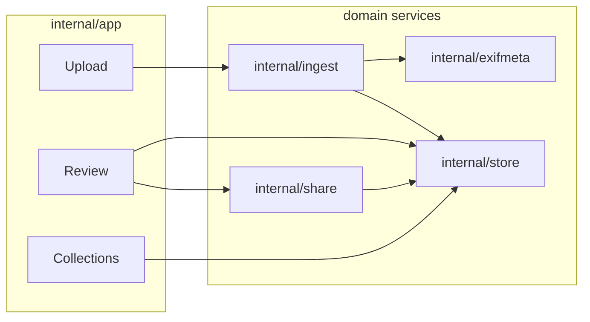

# Codebase map

Navigation guide for the largest and most coupled areas. Package boundaries: [`architecture.md`](../_bmad-output/planning-artifacts/architecture.md) §5.2.

## Application shell

[`internal/app/shell.go`](../internal/app/shell.go) — primary navigation (UX-DR13 order):

1. **Upload** → `NewUploadView` / `upload.go`
2. **Review** → `NewReviewView` / `review.go`
3. **Collections** → `NewCollectionsView` / `collections.go`
4. **Rejected** → `NewRejectedView` / `rejected.go`

[`main.go`](../main.go) wires: config → store → share loopback → `NewMainShell`.

## Review flow

| File | Role |
|------|------|
| `review.go` | Review view container, filter strip, share mint entry |
| `review_grid.go` | Thumbnail grid, paging, loupe open hook |
| `review_loupe.go` | Full-size preview, rating, tags, reject/delete |
| `reject_undo_stack.go` | Session-scoped reject undo (FR-30) |
| `internal/store/review_query.go` | Filtered asset queries |

Tests: `review_test.go`, `review_grid_test.go`, `review_loupe_test.go`, `e2e_shell_journeys_test.go`.

## Upload flow

| File | Role |
|------|------|
| `upload.go` | Drag-drop, staging, collection confirm (FR-06), ingest trigger |
| `drop_paths.go` | Path normalization from OS drop events |
| `thumbnail_disk.go` | Disk thumbnail cache under `{library}/.cache/thumbnails/` |
| `canvas_image_decode.go` | Async decode off UI thread (UX-DR17) |
| `internal/ingest/ingest.go` | Shared ingest + dedup pipeline |

Tests: `upload_test.go`, `upload_fr06_flow_test.go`.

## Share flow

| File | Role |
|------|------|
| `share_loupe.go` | In-app share preview before mint |
| `share_package_flow.go` | Multi-asset share packages (FR-33) |
| `internal/share/loopback.go` | In-process HTTP server lifecycle |
| `internal/share/handler.go` | Routes: `/s/{token}`, `/i/{token}`, etc. |
| `internal/share/ratelimit.go` | Per-IP rate limiter (NFR-06) |
| `web/share/` | Embedded HTML templates and CSS |

Tests: `share_loupe_test.go`, `share_package_flow_test.go`, `internal/share/http_test.go`.

## Collections

| File | Role |
|------|------|
| `collections.go` | List, detail, new-album dialog, grouping |
| `internal/store/collections.go` | CRUD and album queries |
| `internal/store/collection_detail.go` | Detail view data |

## Shared UX infrastructure

| File | Role |
|------|------|
| `theme.go` | Dark/light Fyne theme (UX semantic roles) |
| `ux_image_dims.go` | Minimum thumbnail/loupe/upload preview sizes |
| `nfr07_display_scale_*.go` | OS display scaling probes (platform-specific) |
| `test_theme_env_test.go` | `PHOTO_TOOL_TEST_THEME` helper for tests |
| `ux_journey_capture_test.go` | Full-shell screenshot harness for judge bundles |

## Data flow

## CLI

[`internal/cli/root.go`](../internal/cli/root.go) — `scan`, `import` subcommands call `internal/ingest` with the same `OperationSummary` as the GUI.

No Fyne imports in `internal/cli/` or `internal/ingest/`.

## Schema

Migrations: `internal/store/migrations/00N_*.sql` (applied at startup via `migrate.go`).

When adding columns, add a new numbered migration file; do not edit applied migrations.
